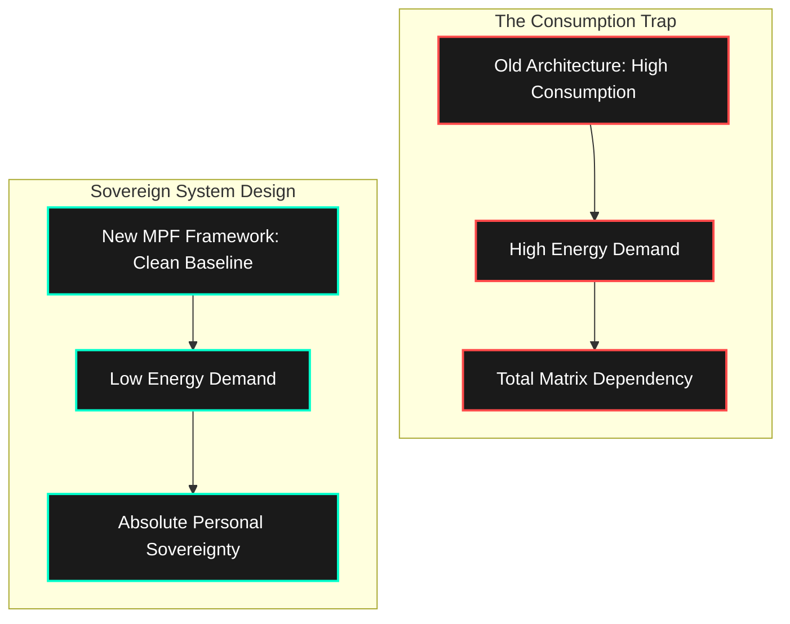

If you are reading this, chances are you are currently running your life-system at 100% CPU capacity just to stand still.

You are dealing with the constant noise of a hyper-connected world, the invisible tax of social validation, the anxiety of economic shifts, and a career that demands your entire attentional bus. You are told that the solution to this exhausting grind is to run faster, work harder, and buy more.

I know exactly how that feels because I used to run that exact same corrupted code.

## The Illusion of Expansion

For years, I made the same structural errors as everyone else. I treated freedom as a wealth-generation problem. I thought that if I could just catch the right wave, I could buy my way out of the meat grinder.

* I jumped into high-energy, chaotic startup vectors that consumed my personal life.
* I obsessively watched highly volatile cryptocurrency charts, letting market fluctuations dictate my daily emotional state.
* I fell into the trap of lifestyle creep, mistakenly believing that higher consumption was a reward for my hard work.

Instead of gaining freedom, I was just building a more expensive cage. My monthly expenses skyrocketed, my attention span was completely fragmented, and I became even more dependent on external corporate platforms and market trends just to maintain my overhead. I was completely burned out, emotionally exhausted, and structurally trapped.

Then, I stopped trying to fix a broken system and decided to change the architecture entirely.

## Dismantling the Trap: The Minimal Path to Freedom (MPF)

I realized a fundamental truth that changed everything: **True structural freedom is not an expansion asset; it is an elimination protocol.**

You don't need to blow up your career, burn your bridges, or move to a remote island to reclaim your life. You simply need to take control of your existing environment. I stopped chasing high-risk windfalls and focused entirely on cutting down my life-system's denominators.

I engineered a framework called the **Minimal Path to Freedom (MPF)**—a technical, step-by-step approach to reclaiming personal sovereignty while keeping a stable day job.

$$E_{\text{load}} = C_{\text{fixed}} + B_{\text{financial}} + T_{\text{titty}} + S_{\text{ego}}$$

By implementing this framework, I transformed my entire daily experience:

* **The Job as an API:** I stripped away all personal ego and corporate office politics from my day job. I turned it into a neutral, transactional cash engine. By automating tasks and using smart templates, I deliver exactly what is required in a fraction of the time, and I keep the leftover mental energy entirely for myself.
* **Cognitive Cleansing:** I stripped away algorithm-driven distractions and sensory overload. I turned my phone to monochrome grayscale, deleted infinite-scroll feeds, and redirected my focus toward high-density, useful knowledge.
* **Hardware Hardening:** I used the principle of **Hormesis** (low-dose, controlled physical stress) to build a resilient body. Through structured fasting, cold water exposure, and circadian rhythm resets, I built a highly adaptable, energetic physical foundation that doesn't rely on expensive supplements or comfort crutches.

I didn't declare war on the world or make a dramatic exit. On a quiet Friday afternoon, while finishing my weekly reports, I completed my personal transition to freedom.

## Why This Blog Exists

I am not a traditional lifestyle guru selling a dream of effortless luxury. I am a **Freedom Architect**. I look at time, attention, finance, and biology through the lens of clean system design and engineering.

This blog is a live document of my ongoing experiments, systems, and automations. It is an engineering manual for anyone who wants to stop being a passive component in someone else's machine and start running their own sovereign system.

### What We Optimize For Here:

* **Elimination over Expansion:** Cutting out financial clutter, toxic social expectations, and sensory noise to drive your monthly overhead down to bare-metal necessity.
* **Workflow Automation:** Using AI, scripts, and smart processing methods to handle repetitive, low-value tasks so you can protect your primary creative focus.
* **Biological Resilience:** Hardening your physical health through practical, science-backed lifestyle adjustments so your mind has a strong, reliable vehicle to operate from.

You don't need anyone's permission to reclaim your life, and you don't need to wait for a perfect market turn. You can choose to run a cleaner, more efficient personal system starting today.

External variables belong to fate. The Root access belongs to you.

Welcome to **KheAi**. Let’s rewrite the code.

### Choose Your Optimization Protocol:

* [Read the Minimal Path to Freedom (MPF) Core Blueprint]
* [Explore Workplace API Automation Workflows]
* [Access the Biological Hardware Hardening Manual]