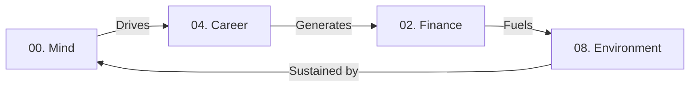

For a long time, I felt like I was playing a game of whack-a-mole with my life. If I focused on my career, my physical health slipped. If I automated my workflows and locked down my productivity, my creative outlets withered away. Most traditional self-help frameworks felt too fluffy, while corporate goal-setting frameworks felt too sterile.

As someone who thinks in code, structures, and systems, I realized I didn't just need a list of resolutions—I needed a comprehensive architecture. I needed a balanced, deduplicated, and deeply integrated **Life Operating System (OS)**.

After deep reflection, iterative testing, and peeling back the layers of what actually drives long-term fulfillment, I have mapped out my personal framework. This is the 0-to-9 index of my life. It is designed to be evergreen, non-overlapping, and structured so that my technical mind can optimize my human experience without burning out.

Here is how I break down the 10 core categories of my life, how they interact, and how I use them to teach myself—and others—how to build a sustainable life ecosystem.

## The System Architecture: 0 through 9

### 0. Philosophy & Mind (The Core Kernel)

Before you write a single line of application code, you need a kernel. For me, Category 0 is the foundational engine that dictates how I process reality. It is the seat of mental models, psychological resilience, mindfulness, and my active belief systems.

- **The Focus:** Deconstructing cognitive biases, managing internal narratives, cultivating emotional intelligence, and anchoring myself in a robust personal philosophy (like Stoicism or rationalism).
- **Why It Matters:** Without a stable core kernel, every other category collapses under stress. If your relationship or career hits a bug, Category 0 determines whether your entire system crashes or whether you gracefully handle the exception.

### 1. The Body (The Biological Vehicle)

You cannot run high-level software on broken, unmaintained hardware. This category treats physical health not as a cosmetic goal, but as a biometric optimization challenge.

- **The Focus:** Sleep architecture (circadian alignment, deep sleep optimization), targeted nutrition, functional fitness (strength, metabolic flexibility, mobility), and long-term longevity.
- **Why It Matters:** Energy is the raw currency of life. If I am sleep-deprived or poorly fueled, my productivity drops, my code suffers, and my emotional bandwidth narrows.

### 2. Financial Engineering (Capital & Cash Flow)

Money is often treated emotionally, which leads to bad decisions. I view finance as an engineering pipeline: capturing raw input (income), optimizing throughput (budgeting and cash flow forecasting), and routing output to storage and growth engines (investing).

- **The Focus:** Granular bookkeeping, proactive budgeting, real-time cash flow forecasting, asset allocation, and multi-generational wealth building.
- **Why It Matters:** Financial independence is the ultimate hedge against external constraints. By treating wealth-building as a data-driven system rather than a guessing game, I buy back my time and sovereignty.

### 3. Relational Ecosystems (Human Connection)

No matter how automated your life is, humans are tribal creatures. This category treats relationships not as accidental occurrences, but as vital ecosystems that require intentional cultivation.

- **The Focus:** Deepening immediate family bonds, maintaining lifelong friendships, nurturing romantic partnerships, and strategically expanding a professional network built on mutual value.
- **Why It Matters:** Loneliness is a systemic toxin. Cultivating clear communication and putting regular "deposits" into relational accounts ensures that my success isn't an isolated island, but a shared experience.

### 4. Venture Architecture (Career & Entrepreneurship)

This is the primary vehicle through which I create value for the world and capture economic upside. It is the active deployment of my energy into businesses, career growth, or entrepreneurial ventures.

- **The Focus:** Market positioning, business model generation, product-market fit, leadership development, and high-level strategic execution.
- **Why It Matters:** True fulfillment requires a sense of agency and impact. Category 4 is where my philosophy meets the marketplace, transforming abstract ideas into scalable solutions.

### 5. Workflow Systems & Infrastructure (The Toolkit)

This is my *metawork* category. It is not the work itself, but the design of the systems that make the work effortless. It is where I build my digital workspace, optimize my focus blocks, and eliminate friction.

- **The Focus:** Automation scripts, personal knowledge management (PKM), continuous integration of software tools, hardware ergonomics, and time-blocking protocols.
- **Why It Matters:** If Category 4 is the race car, Category 5 is the pit crew and the engineering bay. By automating the mundane, repetitive logistics of life, I free up massive amounts of cognitive load for deep work.

### 6. Applied Technology & Engineering (The Craft)

Where Category 5 is about *using* tools to streamline life, Category 6 is about *building* things at the bleeding edge of my technical capability. It is the raw pursuit of mastery in software and technology.

- **The Focus:** Software engineering, learning new programming languages, tinkering with open-source systems, AI/machine learning exploration, and hardware prototyping.
- **Why It Matters:** This keeps my sharpest skills from dulling. It ensures I remain a builder at heart, deeply understanding the mechanics of the digital world rather than just consuming it.

### 7. Horizon Expansion & Cultural Curation (Input / Rest)

High-performance systems require cooling periods. This category is dedicated to changing my physical and mental context, pulling in raw material from outside my immediate technical domain.

- **The Focus:** Slow travel, slow-madism (living intentionally in different cultures), and rigorous cultural curation—deeply consuming historical texts, cinema, classic literature, and arts.
- **Why It Matters:** If you only look at code and business, your perspective becomes rigid. Forcing myself out of routines and deeply understanding diverse human histories provides the raw creative insights that feed back into my philosophy and ventures.

### 8. Environmental Design & Biophilic Infrastructure (The Realm)

This is the bridge between my digital world and the physical Earth. I don't just want to live in an apartment; I want to cultivate a living ecosystem that supports self-sustenance and deep physical harmony.

- **The Focus:** Workspace biophilia, permaculture design principles, urban farming, closed-loop waste systems, and off-grid infrastructure.
- **Why It Matters:** True resilience isn't just digital sovereignty; it's physical security. Integrating technology with natural systems—like data-driven soil monitoring or automated, sustainable irrigation—grounds me and builds a restorative physical baseline.

### 9. Intrinsic Play & Legacy (Output / Joy)

The final slot belongs to the things done purely for their own sake, which naturally mature into what I leave behind. It is the ultimate synthesis of expression and long-term contribution.

- **The Focus:** Intrinsic hobbies (making music, photography, gaming purely for play), mentorship, open-source contribution, and building things designed to outlast me.
- **Why It Matters:** If everything in life is optimized for a return on investment, your spirit starves. Category 9 ensures I maintain a childlike sense of play while aligning my daily efforts with a legacy that transcends my individual ego.

## System Integration: How the Categories Talk to Each Other

The true power of this 10-tier framework lies not in keeping the categories isolated, but in recognizing how they explicitly feed into one another. They form loops and pipelines:

- **The Feedback Loop of 05, 06, and 08:** I use my engineering skills (**06**) and automation workflows (**05**) to build automated gray-water recycling and smart nutrient delivery systems for my urban farm (**08**).
- **The Burnout Protection Loop of 07 and 09:** When my career (**04**) or coding projects (**06**) reach peak cognitive intensity, I deliberately downshift into cultural exploration (**07**) or intrinsic play (**09**) to rest my analytical mind.
- **The Capital Pipeline:** My career (**04**) generates capital, which my financial system (**02**) tracks and reinvests into optimizing my biological health (**01**) and creating sustainable physical environments (**08**).

**The Blueprint Takeaway:** A life without categories is a life lived in reaction mode. By breaking your existence down into clean, non-overlapping modules, you change your relationship with time. You stop trying to do everything all at once. Instead, you gracefully route your focus to the exact module that needs optimization, trusting that the entire system is working in harmony behind the scenes.
