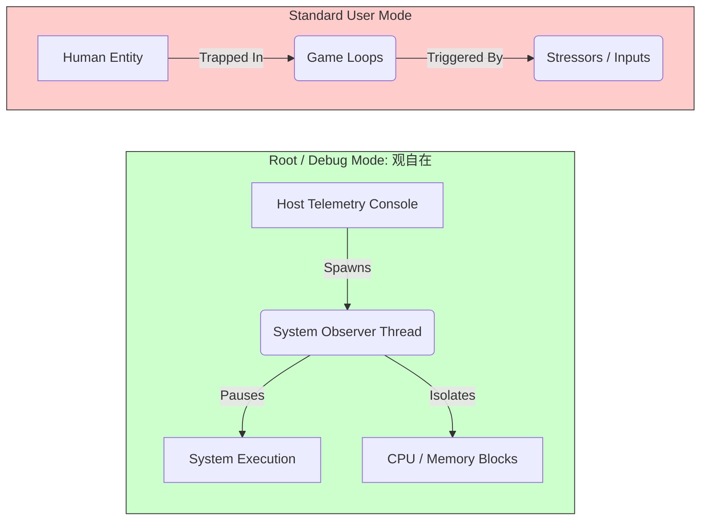
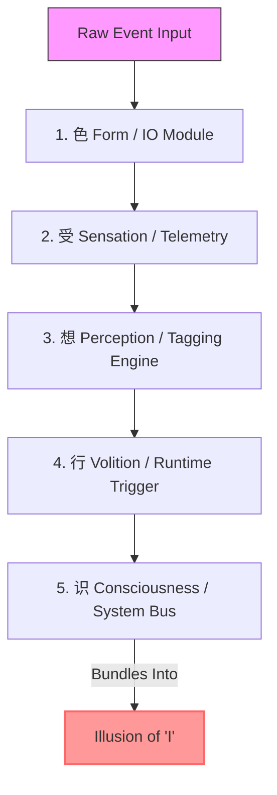
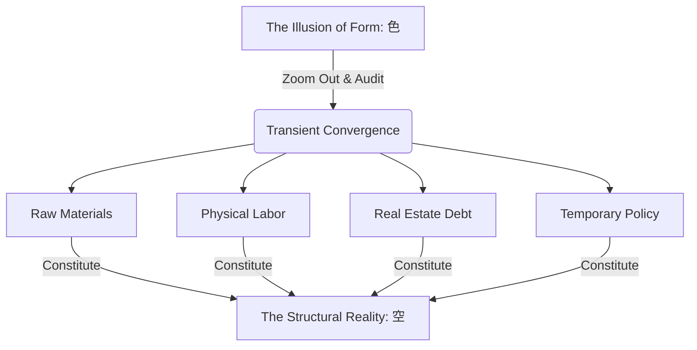
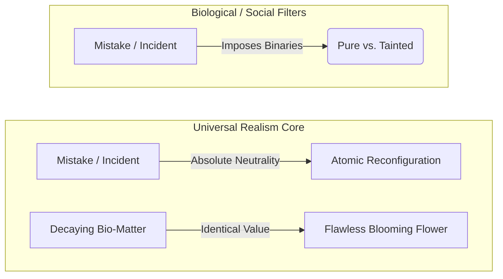
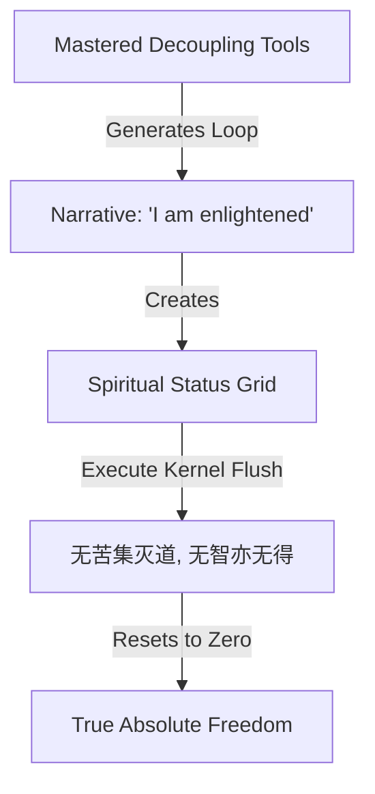
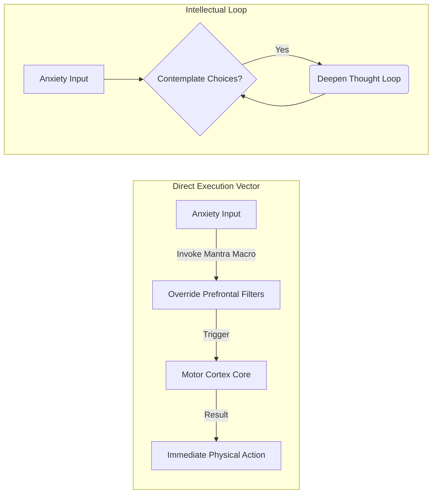
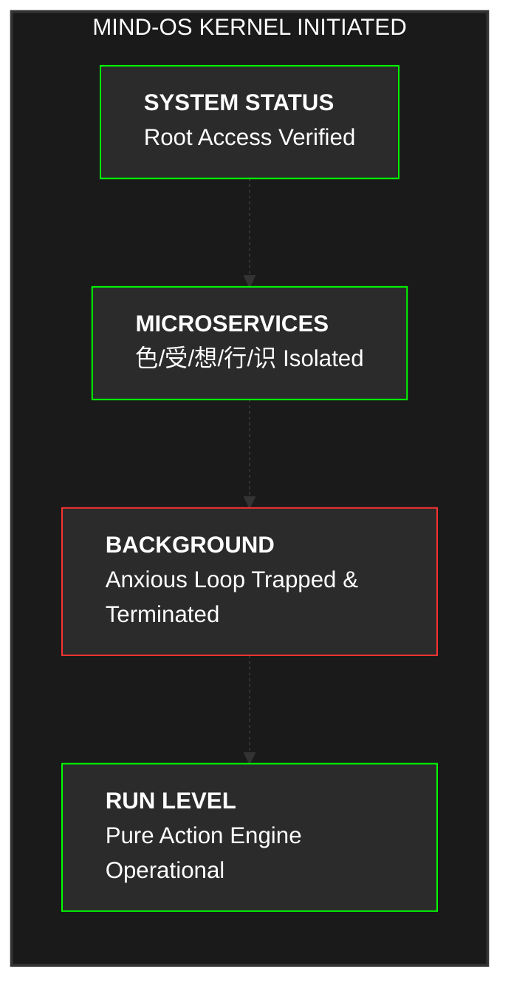

## The Production Incident of the Self

In the information technology sector, when a production server handling tens of millions of concurrent requests abruptly crashes under peak load, the engineer's diagnostic process is ruthlessly clinical. They do not pray, they do not panic, and they certainly do not console the server with motivational platitudes. They cleanly terminate hanging threads, audit low-level log streams, and trap the precise deadlocks or race conditions locking up the system kernel. This is absolute, deterministic systems engineering.

Yet, when we turn this diagnostic lens inward upon ourselves—when our human cognitive infrastructure deadlocks under the weight of corporate anxiety, financial strain, or social performance evaluation—our engineering precision vanishes. Instead of treating psychological distress as a logic error in our runtime environment, we resort to vague, soft-coded self-help loops or force our biological components to "burn through" the fatigue until our hardware fails. 

This is a fundamental misclassification of human cognitive architecture. The human mind does not run on magic; it runs on an archaic biological operating system governed by evolutionary feedback loops and environmental data inputs. 

To fix it, we must execute a root-level system jailbreak. By stripping away the religious and cultural abstractions overlaying the **Heart Sutra (般若波罗蜜多心经)**, we can expose its true design: a cold, highly optimized 260-character source patch engineered to eliminate cognitive enmeshment, terminate background loops, and intercept downstream data-harvesting operations by the societal matrix.

## 1. Initializing Root Access: The Observational Runtime

The architecture patch addresses the issue of system monitoring authority: **When auditing our own mental operations, which process holds the root telemetry access?**

The opening line of the source code establishes the monitoring baseline:

> **观自在菩萨 (Avalokiteshvara Bodhisattva)**

In conventional, top-down cultural frameworks, a *Bodhisattva* is conceptualized as an external, anthropomorphic deity to be worshiped. From a pure systems-architecture perspective, this is an entry-level classification error. 

*   **观 (Observation):** This is not physical sight, but the intentional initialization of a primary telemetry thread. It is a system-level observer mode that operates completely independently of societal tags, moral evaluations, or ego-preservation priorities.
*   **自在 (Autonomy/Presence):** The state of absolute detachment where the process monitoring the system is not altered by the data it inspects. 

You are no longer the frantic, low-level game character running away from high-priority enemy threads inside the execution matrix. You have pressed the pause button, elevated your perspective, and spawned a global system performance monitor that inspects the CPU and memory consumption arrays of the game itself. 

A *Bodhisattva* is not a god; it is a demonstration unit—a system administrator who has successfully claimed root user access (`sudo`) over their biological processing node.

## 2. Decoupling the Five Microservices (五蕴皆空)

To step into this root authority, we must run the primary compilation directive:

> **行深般若波罗蜜多时，照见五蕴皆空，度一切苦厄。**

The keyword here is **深 (Deep)**. This system diagnostic cannot be simulated via superficial prefrontal cortex intellectualization. Merely repeating mental scripts like "I need to let this go" or "I am calm" creates an additional, wasteful background loop that compounds cognitive fatigue. The command requires you to drop down past conscious processing, slicing directly into your autonomic nervous system responses and deep cellular biochemistry to rewrite automated genetic reflexes. 

*波罗蜜多 (Paramita)* represents a complete structural migration: moving your system state from an automated, easily manipulated client node up to an autonomous, server-side paradigm.

This migration is achieved by debugging the **五蕴 (Five Skandhas)**, which are not esoteric concepts, but five microservices assembled dynamically on the fly to process incoming reality data.

### The Breakdown of a System Crash

Consider a high-stress production incident: your company initiates a sudden corporate down-sizing, and your manager publicly berates and terminates your contract. Watch how your microservices process this data payload in milliseconds to trigger a systemic panic state:

1.  **色 (Form - Hardware/IO Module):** The objective physical inputs and structural vectors. This is the raw sound wave of your manager’s voice hitting your eardrums, the specific photons emitted by your screen rendering the termination email, your spiking heart rate, and the acute tightening of your intercostal muscles. This is pure physical and physiological telemetry.
2.  **受 (Sensation - Telemetry Analytics Component):** Your nervous system takes these raw physical inputs and translates them into an instantaneous biochemical value stream. Cortisol and adrenaline flood your bloodstream, registering as a sharp, highly visceral feeling of physiological distress. Up to this point, you are simply observing standard animal hardware mechanics.
3.  **想 (Perception - Metadata Tagging Component):** The cortical layers spin up and begin aggressively attaching socio-cultural labels to the chemical state. It appends labels like: `"CRITICAL_FAILURE"`, `"WORTHLESS_ENTITY"`, `"PUBLIC_HUMILIATION"`, and `"FINANCIAL_RUIN"`.
4.  **行 (Volition - Runtime Trigger Component):** Based on the metadata tags generated by the *Perception* engine, the system attempts an automatic condition-response routine. It schedules immediate survival behaviors: intense fight-or-flight aggression, defensive retaliatory scripts, or a desperate urge to run away and dull the sensation via substance abuse.
5.  **识 (Consciousness - Integrated System Bus):** The central aggregator thread collects the physical inputs, the chemical payload, the catastrophic identity tags, and the survival impulses. It bundles them into a monolithic, persistent illusion: the conviction that an independent, solid entity called **"I"** is being ruined and destroyed by reality.

### The Mechanics of "空" (Emptiness)

The Heart Sutra executes the compilation patch here: **五蕴皆空 (The Five Skandhas are completely empty)**. 

*Emptiness* does not mean that the physical world vanishes into nihilism. It means that none of these five microservices possess a permanent, standalone core or intrinsic reality. They are merely temporary data arrays spun up conditionally on the fly. 

The terrified, humiliated ego experiencing the crisis is not a unified solid entity; it is a temporary pipeline artifact assembled inside a volatile data buffer. When you deploy your root observer mode to trace this pipeline step-by-step, the data-stream loses its anchor points. The humiliation and anxiety instantly lose their physical structural integrity. You do not suppress the emotional data; you intercept its generation vector at the root.

## 3. Demolishing Corporate Hyper-Realities (色不异空)

A common objection arises here: "Even if I can deconstruct my internal emotional payloads, the external world remains harsh. My mortgage debt is real, elite lifestyles are real, and corporate hierarchies are real. If my ego is just a temporary data buffer, what do these massive systems actually mean?"

The source text addresses this directly:

> **舍利子，色不异空，空不异色；色即是空，空即是色。受想行识，亦复如是。**

By addressing *Shariputra* (the avatar of rigid, linear human categorization), the patch challenges our obsession with conceptual labels. In our modern landscape, **色 (Form)** extends far beyond physical objects; it encompasses corporate prestige, luxury aesthetics, lifestyle markers, and the endless array of social status symbols engineered to hijack your attention and monetize your anxiety.

Consider a soaring, steel-and-glass corporate headquarters in a central financial district. It appears massive and immutable, designed to evoke awe and a feeling of individual insignificance. This is the absolute manifestation of *Form*. 

But if you step back and expand your time-horizon, or analyze it through a granular economic lens, the building reveals its true nature: it is a highly volatile, fluid intersection of raw materials, physical labor, commercial real estate debt, and temporary tax policy colliding at a specific point in spacetime. The building contains no permanent entity of "the building". Its identity is completely dependent on this delicate web of transient conditions. This structural dependency is **空 (Emptiness)**.

The corporate hierarchy that intimidates you, the executive title you crave, and the elite status symbols that make you feel inadequate operate on the exact same principles. They are temporary trends in resource allocation, luck, and institutional inertia intersecting for a brief moment. They possess zero inherent permanence.

Once you recognize this equivalence, the artificial values manufactured by consumer culture go bankrupt in your mind. You can seamlessly navigate these societal frameworks without allowing their synthetic data streams to disrupt your internal operating system.

## 4. The Neutrality Matrix and the Illusion of Judgement

To fully insulate your system, you must accept an uncompromisingly neutral cosmological algorithm:

> **诸法空相：不生不灭，不垢不净，不增不减。**

- **不生不灭 (Neither Born Nor Destroyed):** This mirrors the first law of thermodynamics—the conservation of energy. On a fundamental atomic scale, life, death, success, and catastrophic failure are simply structural reconfigurations of existing matter and energy. Birth and decay are localized interpretations created by limited observers.
- **不垢不净 (Neither Tainted Nor Pure):** This is an explosive realization for modern professionals. We carry a crushing psychological burden whenever we make a major mistake, mismanage a project, or experience financial bankruptcy, treating it as an indelible stain on our human value.

In the objective eye of reality, a decomposing organism in the dirt and a flawless lotus blooming in the sun share identical atomic validity and value neutrality. The universe runs no grand judicial console scoring your performance. Your mistakes, your debt, and your unemployment records do not register as system defects on the universe's hard drive; they are simply neutral reconfigurations of data payloads.

Our profound exhaustion stems from a hardcoded **Spotlight Effect (虚假观众效应)**. We operate under the delusion that we are performing on a massive stage, with an invisible audience mocking our missteps. But if you look down into the stadium seats, you will realize the theater is completely empty. There is no audience, and there is no judge.

Your life ledger balances perfectly on a macro level: **不增不减 (Neither Increasing Nor Decreasing)**. Every apparent loss is simply the starting vector of an alternative resource configuration. When you terminate these toxic self-flagellation background tasks, you instantly reclaim massive amounts of processing power to invest in solving tangible, real-world problems.

## 5. Overcoming Spiritual Narcissism: The Ultimate Kernel Flush

Once the mind is scrubbed clean, it encounters its most dangerous pitfall:

> **空中无色，无受想行识……无苦集灭道，无智亦无得，以无所得故。**

When you learn to view your internal narratives as data buffers, optimize your mental health, and master these decoupling techniques, your system will naturally try to flag another subtle error: **Spiritual Narcissism (灵性自恋)**.

The ego spins up a new status routine: *"Look at me, I am an enlightened entity. I understand systems architecture, I have mastered detachment, while the masses are still trapped in consumer loops."*

The Heart Sutra neutralizes this with clinical precision. It steps forward to systematically deconstruct the core pillars of its own philosophy—the Four Noble Truths (*无苦集灭道*) and Wisdom itself (*无智亦无得*).

The system architecture handbook warns us: **The tools of liberation are nothing more than temporary prescription scripts used to clear specific errors. If you transform the medicine into an unshakeable badge of identity, you have simply moved into a slightly more luxurious, spiritual prison cell.**

The ultimate baseline of the entire architecture is **以无所得故 (With absolute nothing to be acquired)**. There is nothing in this universe that can be permanently owned—not wealth, not physical forms, and certainly not spiritual milestones. When you completely accept this un-compromised state of zero-possession, you become invulnerable. When you have no assets to defend, you dissolve the gravitational field that feeds human fear.

This state is **涅槃 (Nirvana)**. It is not a mystical, disembodied ascension into the clouds. It is the state where your brain's CPU temperature drops back to a cool baseline because it has stopped burning 90% of its processing power running anxious background simulations about what other people think. It is an un-defended, highly stable state of pure processing efficiency.

## 6. The Execution Routine: Bypassing Intellect via Physical Compilation

How do we compile this blueprint into concrete physical action? The source text provides an explicit terminal instruction:

> **揭谛揭谛，波罗揭谛，波罗僧揭谛，菩提萨婆诃。**

A *Mantra* is not a magical invocation designed to bend physical reality; it is a rapid-fire mental macro—a functional tool engineered to bypass the anxious verbal filters of your prefrontal cortex and directly trigger your motor cortex.

Translated cleanly, this closing directive is not a gentle prayer; it is a raw command:

**"Go. Terminate the infinite loops in your head. Cross the barrier. Move your physical body and execute."**

When acute anxiety paralyses your system and freezes you in bed, do not waste energy trying to negotiate with your thoughts or decode the meaning of life. You cannot think your way out of a thinking trap. You must completely bypass the intellectual layer and force physical execution on immediate, small-scale tasks:

- Do not contemplate your career path; clear the dirty dishes in your sink.
- Do not debate your financial future; throw your laundry into the washing machine.
- Do not analyze your writing fears; open your editor and write the first raw line of code.

By initiating physical action, you generate immediate sensory feedback loops that break the chemical grip of cortisol and dopamine stagnation. You reclaim read/write privileges over your internal operating system through action. True awakening is found in daily execution.

## 7. Hardcoding the Present State

Many professionals fallback on a classic conditional loop: *"Once I build enough capital, secure financial freedom, and quit this corporate job, I will finally dismantle my anxiety and live authentically."*

This is a dangerous trap generated by the *Perception* microservice. It projects your peace of mind onto a distant, hypothetical metric, spawning a fresh loop of ambition-driven stress.

You do not need to hit a net-worth target to terminate internal friction. You can downgrade the emotional weight of your corporate environment today. Treat your day job as a neutral transaction—a secure liquidity machine that funds your basic physical requirements.

Then, allocate your remaining focus to building your personal infrastructure: the side endeavors, development projects, or daily disciplines that establish local order within your corner of the system. Spend thirty minutes writing clean code, organizing your development workspace, or studying a complex framework. Initialize that execution thread immediately.

Once you recompile your mind-OS, you encounter a beautiful paradox: **Because you understand that everything is a temporary convergence of elements destined to disassemble, and that no universal audience is grading your life, the paralyzing pressure to build a manufactured identity completely disappears.**

The daily friction of reality continues. Physical aging progresses, market conditions shift, and operational demands arrive on schedule. But you no longer view these events through a lens of fear.

Your terminal is open, you hold root system privileges, and your background loops are clean.

The system is ready. Write your next line of code.
