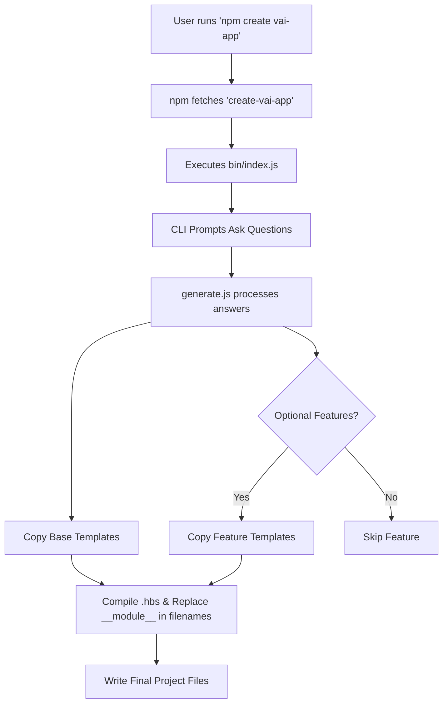

If you have ever bootstrapped a project using a command like `npm create vite` or `npx create-react-app`, you know how magical the experience feels. Recently, I set out to build my own scaffolding tool: `create-vai-app`. I want to take you behind the scenes and teach you exactly what I learned, transforming you from a total beginner into someone with a published npm package.

Here is my detailed, step-by-step guide on how I went from zero to published.


## The Core Mechanic: What Are We Building?

When a user types `npm create vai-app` or `npx create-vai-app my-project`, a simple but powerful sequence occurs.

First, npm searches for your published package on the registry (in this case, `create-vai-app`). Next, it looks for the package's `bin` entry point and executes it. This script asks the user a series of interactive questions and then automatically writes the appropriately configured files into a brand-new folder. That is the entire underlying mechanic.

Here is a visual representation of the flow:



## Prerequisites

Before writing any code, I made sure my environment was ready. You need absolutely no complex build tools for this—basic familiarity with `npm init` is enough.

| **Requirement**   | **Why You Need It**                                          |
| ----------------- | ------------------------------------------------------------ |
| **Node.js 18+**   | Our template generation relies heavily on modern `fs/promises` APIs. |
| **npm account**   | You need an account on npmjs.com, which is completely free and required to publish. |
| **Terminal Auth** | Running `npm login` in your terminal authenticates your machine so you have permission to publish. |

## Step 1: The Package Architecture

I started by structuring my folders cleanly. Keeping the CLI logic separated from the templates makes maintenance a breeze. Here is the exact structure I used:

```
create-vai-app/
├── bin/
│   └── index.js          ← CLI entry point (runs when user invokes it)
├── templates/
│   ├── base/             ← files every project gets
│   │   ├── src/
│   │   │   ├── main.ts.hbs
│   │   │   ├── app.module.ts.hbs
│   │   │   └── __module__/
│   │   │       ├── __module__.service.ts.hbs
│   │   │       ├── __module__.controller.ts.hbs
│   │   │       └── __module__.service.spec.ts.hbs
│   │   ├── CLAUDE.md.hbs
│   │   ├── .env.example.hbs
│   │   ├── Dockerfile.hbs
│   │   └── README.md.hbs
│   ├── talkinghead/      ← copied only if user picks TalkingHead
│   │   └── src/__module__/talkinghead.service.ts
│   └── websocket/        ← copied only if user picks WebSocket
│       └── src/__module__/__module__.gateway.ts.hbs
├── package.json
└── README.md
```

You will notice `.hbs` extensions scattered throughout. These are Handlebars template files. They allow us to inject variables directly into the code using syntax like `{{project}}` and `{{Module}}`, or even conditionally render entire blocks of code using `{{#if hasTalkingHead}}...{{/if}}`.

Additionally, the folder and file names containing `__module__` are special placeholders; they get replaced with the actual module name chosen by the user during the copying process. For example, `__module__.service.ts` dynamically becomes `interview.service.ts`.

## Step 2: Setting up Dependencies

I wanted to keep dependencies as minimal as possible to ensure fast installation. I ran the following command to grab the core four tools:

```bash
npm install prompts fs-extra handlebars chalk
```

| **Package**  | **What It Does**                                             |
| ------------ | ------------------------------------------------------------ |
| `prompts`    | Powers the interactive CLI questions, similar to the first step of our skill workflow. |
| `fs-extra`   | Provides powerful file system methods to easily copy directories and ensure paths exist. |
| `handlebars` | Compiles template files containing `{{variable}}` and `{{#if flag}}` logic. |
| `chalk`      | Adds colors to the terminal output for a polished user experience. |

## Step 3: Configuring `package.json`

The `package.json` file needs specific configurations to act as a CLI tool. I defined the `bin` property to map the command `create-vai-app` to my executable file.

Here is how the configuration looks:

```json
{
  "name": "create-vai-app",
  "version": "1.0.0",
  "type": "module",
  "bin": { 
    "create-vai-app": "./bin/index.js" 
  },
  "files": [
    "bin", 
    "templates"
  ],
  "engines": { 
    "node": ">=18" 
  }
}
```

I added `"type": "module"` because I prefer writing modern ES modules (using `import` and `export`). The `files` array is crucial because it ensures that only the `bin` and `templates` folders get packaged and published to npm.

## Step 4: Building the CLI Entry Point

The `bin/index.js` file is the front door of the application. It runs immediately when the user executes the command. I used the `prompts` library to gather user preferences.

```javascript
#!/usr/bin/env node
import prompts from 'prompts';
import { generate } from '../lib/generate.js';

// The Shebang line above is strictly required to tell the OS to run this via Node.

const answers = await prompts([
  { type: 'text',   name: 'project',     message: 'Project name (kebab-case)' },
  { type: 'text',   name: 'module',      message: 'Domain module name (e.g. interview)' },
  { type: 'toggle', name: 'hasWebSocket',message: 'Real-time WebSocket?', initial: true },
  { type: 'toggle', name: 'hasGemini',   message: 'Google Gemini AI?',    initial: true },
  { type: 'toggle', name: 'hasTalkingHead', message: 'TalkingHead 3D avatar?', initial: false }
]);

await generate(answers);
```

## Step 5: The Core Generation Logic

Next, I wrote `lib/generate.js` to handle copying files and rendering templates. This script takes the user's answers, copies the base templates, and conditionally adds feature-specific templates based on their choices.

```javascript
import { copy, outputFile } from 'fs-extra';
import Handlebars from 'handlebars';
import path from 'path';

// Helper to convert 'interview' -> 'Interview'
const toPascalCase = (str) => str.charAt(0).toUpperCase() + str.slice(1);

export async function generate(answers) {
  const dest = path.resolve(answers.project);
  const vars = {
    ...answers,
    Module: toPascalCase(answers.module), // interview → Interview
  };

  // Copy base templates and render each .hbs file
  await renderDir('templates/base', dest, vars);

  // Conditionally copy feature templates
  if (answers.hasWebSocket)   await renderDir('templates/websocket', dest, vars);
  if (answers.hasTalkingHead) await renderDir('templates/talkinghead', dest, vars);

  console.log(`✅ Created ${answers.project} — run: cd ${answers.project} && npm install`);
}
```

By passing `vars` into Handlebars, a base template like `src/main.ts.hbs` dynamically generates correct code. For instance, Handlebars syntax in a TypeScript template looks like this:

```typescript
// templates/base/src/main.ts.hbs
import { NestFactory } from '@nestjs/core';
{{#if hasTalkingHead}}
import { TalkingHeadService } from './{{module}}/talkinghead.service';
{{/if}}
```

## Step 6: Testing Locally

Before exposing my code to the world, I had to ensure it actually worked. I highly recommend testing locally before publishing. You have two reliable options for this:

- **Option A:** Navigate into your `create-vai-app` directory and run `npm link` to link the package globally, then run `npm create vai-app test-project` to execute your local version.
- **Option B:** Run the script directly by typing `node ./bin/index.js` in your terminal.

## Step 7: Publishing to NPM

The publishing step is surprisingly straightforward.

First, I executed a one-time login command that opens the browser for authentication:

```bash
npm login
```

Once authenticated, I pushed the package to the public registry:

```bash
npm publish --access public
```

Setting access to public ensures that the package remains free on npmjs.com. Immediately after, anyone in the world could spin up a project using my tool by running `npm create vai-app my-project` or `npx create-vai-app my-project`.

## Step 8: Maintenance & Versioning

Publishing is only the beginning. Keeping the package updated requires disciplined versioning. I strictly follow Semantic Versioning (SemVer) for my updates.

- If there is a bug in the generated code, I fix the template, bump the **patch** version, and republish.
- If I want to add a new optional feature, I add a new `prompts` question, create a new `templates/feature-name/` folder, and bump the **minor** version.
- If there is a breaking change to the generated project structure, I bump the **major** version (e.g., from `1.x.x` to `2.0.0`).
- If `vai-brain` introduces a new feature, I update the matching template file, bump the appropriate version, and run `npm publish`.

I also keep a `CHANGELOG.md` file so users running `npm info create-vai-app` can easily track what has changed in the latest releases.

## The Reality: Time Investment

For a beginner, the timeline to pull this off is entirely manageable. I mapped out the process, and it took me roughly 1 to 2 days total.

| **Phase**                                                  | **Estimated Time** |
| ---------------------------------------------------------- | ------------------ |
| Understanding the structure and setting up the npm account | 1–2 hours          |
| Writing `bin/index.js` and `lib/generate.js`               | 2–3 hours          |
| Converting all skill templates into `.hbs` files           | 3–5 hours          |
| Testing locally and fixing edge cases                      | 1–2 hours          |
| Publishing and writing the package README                  | 1 hour             |

Ultimately, building this CLI was essentially writing a specification—the questions, variables, and file structures map exactly 1:1 to what an AI scaffolding skill does, just beautifully automated with Node.js instead. Getting your own package on the npm registry is an incredibly satisfying milestone. Build it, publish it, and share it with the community!
