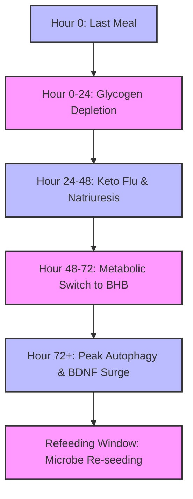
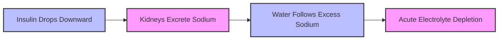
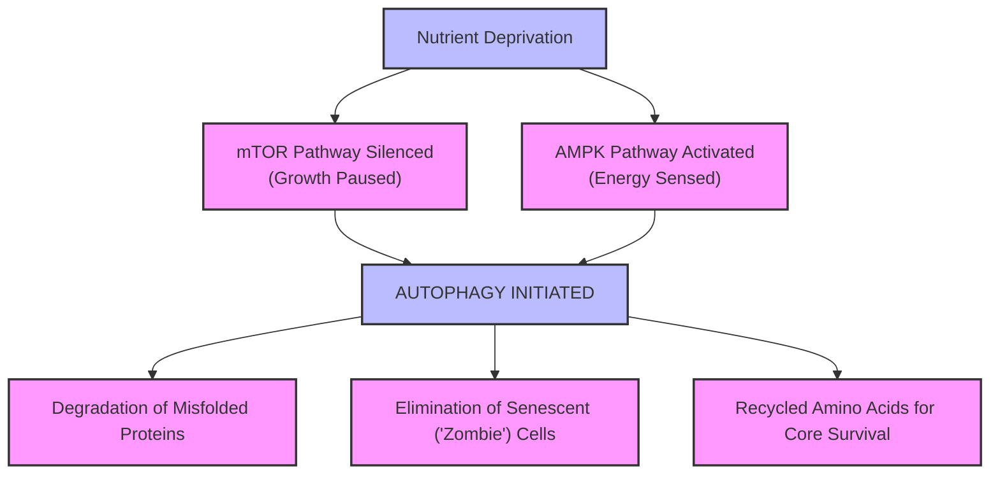
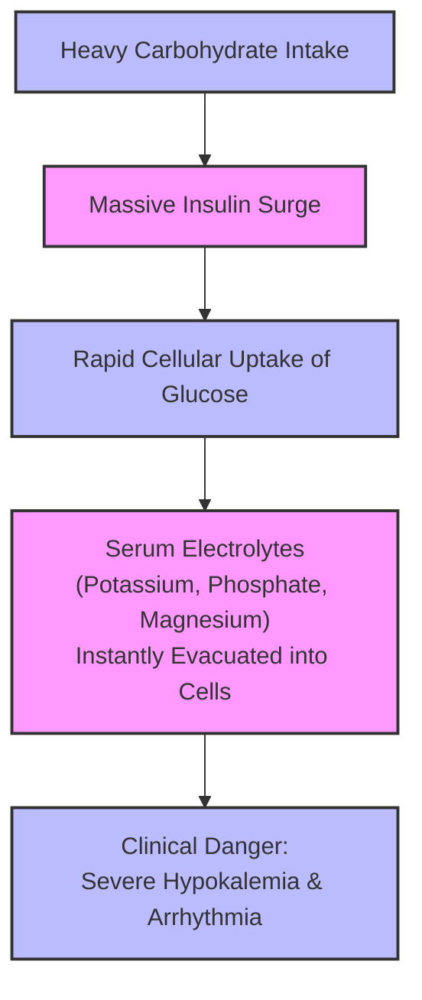
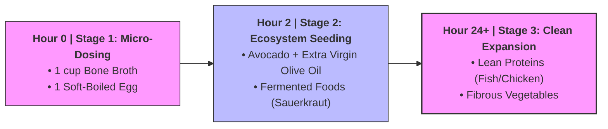

We often talk about "decoupling"—the practice of consciously disconnecting your mind from societal labels, systemic noise, and internal loops so you can re-enter the world with a clear, unshakeable edge.

What surprised me most on my journey is that this exact system architecture metaphor maps beautifully onto our physical bodies. Enter **prolonged fasting**.

Most people misunderstand prolonged fasting as a grueling exercise in ascetic willpower or a primitive form of self-punishment. From a systems-theory perspective, it is something entirely different: a deliberate, highly coordinated **hard reset of both your biological and psychological operating systems**.

When I undertook this protocol, I didn't just stop eating; I initiated a deep metabolic jailbreak. Below is my comprehensive, scientifically cross-examined, and philosophically grounded blueprint for navigating a multi-day prolonged fast.

## The Metabolic Switch Matrix

To understand how the body transitions from an external fuel ecosystem to an internal self-sustaining architecture, let's map out the systemic timeline:

## Phase 1: The 72-Hour Glide Slope (Preparation)

*Objective: Powering down the Glucose Bus without triggering a system crash.*

When I first planned my fast, I noticed many people throw a "Last Supper" party, gorging on heavy carbohydrates right before starting. This is a massive psychological and biological mistake—a form of compensatory consumption driven by panic.

### The Insulin Deadlock

A high-carbohydrate final meal triggers a massive spike in insulin. High circulating insulin acts as a biochemical lock on your adipose tissue by inhibiting **Hormone-Sensitive Lipase (HSL)**, the enzyme required to mobilize stored fat. When your blood sugar inevitably crashes a few hours later, your body is blocked from accessing its fat stores, plunging you into an artificial hypoglycemic crisis on Day 1. You end up fighting intense, artificial hunger pangs before the fast even begins.

### My Blueprint for a Tactical Glide Slope

Instead of cutting cold turkey from a standard diet, I treat the 72 hours *before* the fast as an intentional runway:

- **72-Hour Ketogenic Shift:** Three days prior to hitting start on my fasting timer, I eliminate processed carbohydrates and switch entirely to a strict ketogenic profile (high fats, moderate proteins, leafy greens). This gently depletes roughly **70% or more** of my liver glycogen reserves while keeping blood sugar remarkably stable.
- **Zone 2 Glycogen Evacuation:** During this runway, I integrate low-intensity **Zone 2 cardio**—such as a 45-minute brisk walk or light cycling. Zone 2 training relies almost exclusively on slow-twitch muscle fibers powered by fat oxidation, drawing down residual intramuscular glycogen without spiking **cortisol** (the primary stress hormone).

By the time the timer officially starts, the metabolic engine has already completed a smooth, quiet migration from burning glucose to burning ketones.

## Phase 2: Days 1–2: The Biochemical Firestorm (Transition)

*Objective: Surviving the "Natriuresis of Fasting" and conquering the Default Mode Network.*

The first 48 hours of a fast are undeniably the hardest. It represents a metabolic "Valley of Shadow," where your old fuel source is gone, and your new fuel source isn't fully online yet. This is where most people quit because they misinterpret normal biological signaling as a life-threatening crisis.

### 1. Defending Against the Mineral Flood

As blood glucose stabilizes and insulin levels plummet to baseline, a fascinating renal phenomenon occurs: the **Natriuresis of Fasting**.

When insulin is low, the kidneys receive a direct signal to stop reabsorbing sodium in the proximal tubules. Your body rapidly flushes out stored water, carrying vital electrolytes—**sodium, potassium, and magnesium**—along with it.

- **The Illusion of Weight Loss:** When you lose 5 lbs in the first 48 hours, do not celebrate. It is almost entirely water and salt, not adipose tissue.
- **De-dramatizing the "Fasting Flu":** When electrolytes drop, your brain flags a system error, manifesting as headaches, brain fog, or mild heart palpitations. Most people think, *"I'm starving to death."* In reality, they are just low on salt.
- **The Solution:** I treat this purely as a technical problem. At the first sign of lethargy, I dissolve half a teaspoon of high-quality sea salt in warm water or place a pinch of coarse pink salt directly under my tongue. The symptoms vanish within 15 minutes. By separating biochemical signaling from emotional drama, internal friction drops to zero.

### 2. Cognitive Re-architecting: Activating "Hunter Mode"

Hunger is not a linear curve that grows worse over time. It is driven by **ghrelin**, an orexigenic hormone that pulses rhythmically according to your established circadian biology. If you normally eat lunch at 12:00 PM, ghrelin will spike at 12:00 PM, screaming for fuel. If you ignore it, ghrelin naturally recedes within 45 minutes, whether you eat or not.

To ride out these waves, I leverage an evolutionary adaptation I call **Hunter Mode**. As glucose levels remain low, the brain releases a surge of **counter-regulatory hormones**, particularly **norepinephrine**. From an evolutionary standpoint, your body believes it is in a state of food scarcity; it sharpens your focus, increases your alertness, and gives you a burst of energy so you can hunt for your next meal.

Instead of sitting around focusing on hunger, I intentionally redirect this cognitive bandwidth toward high-complexity tasks:

> When Hunter Mode kicks in, I dive straight into deep, focused work—whether it's debugging a complex codebase, writing technical essays, or tackling deep strategic planning. The brain enters a flow state, effectively telling the gastrointestinal tract: *"We are currently hunting. Postpone all digestive feedback."* Hunger immediately fades into the background.

## Phase 3: Days 3+: The Zen State (System Optimization)

*Objective: Capitalizing on Cellular Self-Cleaning and Neuroplasticity.*

By Day 3, a profound calm settles in. The body has fully adapted to its internal fuel grid. **Beta-Hydroxybutyrate (BHB)**—the primary ketone body—crosses the blood-brain barrier via monocarboxylate transporters, providing a highly efficient, clean-burning alternative to glucose.

Because ketone metabolism generates significantly fewer reactive oxygen species (ROS) than glucose oxidation, systemic inflammation drops dramatically, creating an unmistakable sensation of mental clarity.

### 1. Autophagy: The Ultimate Cellular Quality Control

With no external nutrients coming in, the **mTOR (mammalian target of rapamycin)** pathway—the body’s main nutrient-sensing growth engine—is completely silenced. Concurrently, **AMPK (AMP-activated protein kinase)** is highly activated. This specific shift triggers intense **macroautophagy**.

During peak autophagy, your cells behave like a highly efficient recycling facility. Lacking external building blocks, they scan their internal environments for junk assets: malformed proteins, damaged mitochondria (the primary cause of cellular aging), and senescent or "zombie" cells that secrete inflammatory signals. The cell packs these into double-membraned vesicles called autophagosomes, fuses them with lysosomes, and breaks them down into raw amino acids to rebuild vital structures. It is a completely natural, internal structural renewal.

### 2. Neurogenesis and the Muscle Shield

Two major concerns people have about prolonged fasting are brain starvation and muscle wasting. Both are thoroughly debunked by evolutionary biology.

- **BDNF (Brain's Miracle-Gro):** Under the influence of elevated BHB, the expression of **Brain-Derived Neurotrophic Factor (BDNF)** in the hippocampus surges. BDNF stimulates the differentiation of neural stem cells into functional neurons and enhances synaptic plasticity. My thoughts during this phase feel razor-sharp, free from the postprandial energy dips that define a standard diet.
- **The 2000% Growth Hormone Shield:** A common critique is that fasting burns through hard-earned muscle. However, data shows that during a prolonged fast, **human growth hormone (HGH)** secretion spikes by **up to 2000%** in men and **1300%** in women over baseline. The body's survival logic is elegant: muscle is the primary tool needed to forage or hunt for food. It would be a catastrophic evolutionary design flaw to burn muscle while retaining fat. The body aggressively prioritizes the breakdown of visceral and subcutaneous fat for fuel, while HGH preserves lean muscle tissue and bone density.

## Phase 4: The Refeeding Protocol (The Most Dangerous 2 Hours)

*Objective: Preventing Refeeding Syndrome and Re-engineering the Gut Microbiome.*

Breaking a prolonged fast is the most critical part of the entire protocol. A long fast turns your digestive tract into an inactive, highly sensitive environment. Bringing a dormant system back online too quickly can cause a major system failure.

### 1. The Pathophysiology of Refeeding Syndrome

If you break a four-day fast with a heavy, high-carbohydrate meal (like pizza or pasta), you risk triggering a dangerous clinical phenomenon known as **Refeeding Syndrome**.

The sudden flood of glucose causes an intense insulin surge, forcing cells to immediately pull glucose out of the bloodstream. To process this glucose, cells rapidly pull in **phosphorus, potassium, and magnesium** from the surrounding blood. This sudden shift can instantly deplete your serum electrolyte levels, causing severe muscle weakness, dangerous cardiac arrhythmias, or acute respiratory distress.

### 2. My Structured Two-Stage Re-entry Plan

To safely bring the digestive system back online, I treat refeeding as a precise, multi-tier software deployment.

#### Stage 1: The Micro-Dosing Window (Hours 0–2)

I break the fast using a minimal, nutrient-dense protocol designed to gently wake up digestive enzymes without triggering an insulin response:

- **1 cup of warm, high-quality organic bone broth:** This delivers bioavailable amino acids (like glycine) and minerals (phosphorus and potassium) without spiking blood sugar.
- **1 warm soft-boiled egg:** Provides easily digestible proteins and fats.

Once consumed, I step away from food and wait exactly **two hours**. This allows the gastrointestinal tract to re-establish blood flow, activate stomach acid production, and confirm that the digestive system is successfully online.

#### Stage 2: Ecosystem Seeding (Hours 2–24)

After a multi-day fast, the gut microbiome is essentially a clean slate. The opportunistic, sugar-loving bacteria have been starved out, leaving an incredibly receptive environment. This is your premier window to intentionally design your internal ecosystem:

- **Premium Fats:** Half an avocado drizzled with extra virgin olive oil. This introduces clean, dense fuel that requires minimal insulin production.
- **Probiotic Fermented Foods:** Two tablespoons of unpasteurized sauerkraut, authentic kimchi, or sugar-free kefir. This directly seeds your pristine gut walls with beneficial strains like *Lactobacillus* and *Bifidobacterium*.
- **What I Avoid:** For at least **72 hours** post-fast, I completely avoid refined sugars, grains, dairy, and ultra-processed foods. Introducing junk food during this critical window gives harmful bacteria an immediate foothold, undoing the anti-inflammatory benefits of the entire fast.

## Conclusion: Mind Over Matrix (The Metacognitive Awakening)

When you complete this protocol, you will find your relationship with food radically transformed. Your taste buds are reset to baseline; a plain piece of broccoli or a single almond tastes intensely vibrant and complex. Your dopamine reward pathways are completely cleansed.

But the most significant transformation is psychological.

In our daily lives, we are constantly running subroutines written by society—arbitrary timelines, societal standards, career anxieties, and algorithmic notifications. We treat these social pressures as absolute laws of nature.

Prolonged fasting shatters that illusion. It forces you to confront, analyze, and master the most primal, deeply rooted evolutionary drive built into human design: the instinctual urge to eat.

When you prove to yourself that you can consciously manage, deconstruct, and elegantly navigate your body through intense hunger signals using clear, actionable protocols, your worldview shifts. You gain a powerful, objective perspective on the rest of your life:

> If the most deeply wired biological programming can be mastered and redesigned through clear thinking and system logic, then any societal expectation, career anxiety, or daily stress is just an arbitrary habit—a minor line of code that you have the complete authority to rewrite, optimize, or delete entirely.

Fasting isn't about starving your body; it's about breaking free from automatic patterns. Take command of your internal architecture, work *with* your biology, and claim full administrative control over both your physical health and your mind.
