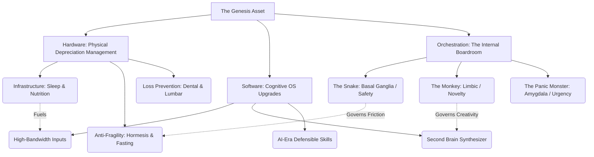

For the longest time, I was caught up in the same collective financial anxiety as everyone else. I spent hours staring at market trends, calculating risks, and stressing over volatile asset classes. *Is the housing market locking up my liquidity? How much purchasing power is inflation quietly stealing from my bank account? Is crypto about to pull another 50% drawdown overnight?*

After ruthlessly auditing the data, one truth became undeniably clear:

**In the grand scheme of investment portfolios, you are the Genesis Asset. You are the ultimate production tool.**

Real estate depreciates. Fiat cash devalues. Financial markets can wipe out a portfolio in an afternoon. But the cognitive frameworks wired into your brain, the energy produced by a meticulously fueled body, and the psychological alignment of your inner drives cannot be stolen, taxed, or liquidated by a margin call.

This is my master system. I stopped treating myself like a fragile consumer and started operating like the CEO of a high-performance enterprise. Here is exactly how I rigorously fact-checked, tested, and optimized my **Hardware (Body)**, my **Software (Mind)**, and my **Internal Boardroom (Psychology)** to build an evergreen, crash-proof life.

## 🏛️ The Master System Architecture

Before diving into the exact protocols, it helps to see how the entire ecosystem connects. This is the operating model I use to run my life:

## 🛠️ Part I: Hardware Asset Management (The Server)

If your mind is an elite software application, your body is the server hosting it. If the server overheats or suffers from systemic hardware failure, the most brilliant algorithms become useless. My strategy here is ruthless: **Minimize the daily rate of depreciation and maximize peak power output.**

### 1. Core Infrastructure: Sleep Quality and Precision Nutrition

- **The 90-Minute Sleep Arbitrage:** Sleep isn't downtime; it is the active flushing of toxic metabolic waste (like beta-amyloid plaques) from the brain. I stopped tracking "8 hours" and shifted to **90-minute sleep cycles**. My target is 5 complete cycles (7.5 hours). By anchoring my circadian clock (waking up within the same 60-minute window daily) and locking bedroom temperatures between **18°C–22°C**, I ensure I wake up at the end of a REM cycle rather than being yanked out of deep sleep.
- **Precision Fueling (Zero-Crash Protocol):** Eating highly processed food is like pouring unrefined sludge into a Formula 1 engine. My diet is heavily anchored on **High Quality Protein + Essential Fats + Complex Carbohydrates + Dietary Fiber**. I eliminated refined sugars to avoid the postprandial somnolence (the post-lunch crash) that murders executive focus.
- **Quantified Hydration:** The formula is non-negotiable: $30\text{ml} \times \text{Body Weight (kg)}$. A mere 2% drop in cellular hydration results in a measurable decline in cognitive processing speed.

### 2. Performance Optimization: Hormesis & Autophagy

Assets left in a stress-free vacuum become fragile. I use evolutionary biology to force my system to upgrade itself.

- **Hormesis (Controlled Stress):** What doesn't kill you makes your cells hyper-resilient. I use cold exposure (showers) and heat shock (saunas) to stimulate **Heat Shock Proteins (HSPs)**, which act as cellular mechanics to repair misfolded proteins. I also deploy High-Intensity Interval Training (HIIT) to force brief cellular hypoxia, prompting my mitochondria to multiply and expand my energy baseline.
- **Fasting (Cellular Housekeeping):** Fasting is not starving; it is metabolic management. Using a **16:8 protocol** (eating within an 8-hour window) or occasionally a **5:2 approach**, I trigger **Autophagy**. In the absence of incoming calories, the body hunts down and recycles damaged cells and metabolic waste. The ROI is massive: high insulin sensitivity, lowered inflammation, and razor-sharp, ketone-fueled mental clarity.

### 3. Asset Loss Prevention: Precision Defenses

I treat my body's vulnerabilities like structural rot in a house. The two most expensive, debilitating failure points are dental decay and spinal degradation.

- **Maxillofacial Defense (Dental):** Dental damage is irreversible. Periodontal inflammation directly feeds cardiovascular risk. My protocol: A high-vibration sonic toothbrush using the Bass technique, mandatory nightly **flossing** (to clean the 40% a brush misses), and bi-annual professional scaling and polishing. Spending $100 today prevents a $10,000 root canal and systemic health degradation tomorrow.
- **Lumbar Preservation (Spine):** Lower back pain is the modern tax on sitting. It’s caused by "glute amnesia" and weak core stabilizers. I use a motorized standing desk, enforcing a **3:1 sit-to-stand ratio**. Daily, I invest 5 minutes into **Glute Bridges** and **Dead Bugs** to activate the posterior chain. Finally, I entirely eliminated straight-leg bending; every lift is a strict hip-hinge.

## 💡 Part II: Software Architecture (The Operating System)

A pristine biological server is useless if it runs outdated cognitive software. Upgrading the mind is about widening your information bandwidth, building external logic systems, and acquiring skills that machines cannot easily replicate.

### 1. High-Bandwidth, Low-Noise Information Funnel

Your mind becomes the exact reflection of the data it consumes.

- **Source Domination:** I relentlessly purged high-dopamine, low-substance algorithm feeds. Instead of reading secondary opinion pieces, I go to the primary sources: academic journals, corporate financial disclosures, and the original books.
- **Meta-Knowledge:** I dedicate deep blocks of time to disciplines that do not depreciate: behavioral psychology, microeconomics, probability theory, and systems thinking. These are the lenses that decode reality.

### 2. Building the "Second Brain"

The human brain is an incredible processing unit, but a terrible hard drive. I built a digital architecture (using tools like Notion/Obsidian) to create an **Input-to-Output Asset Loop**:

- **Capture $\rightarrow$ Clarify $\rightarrow$ Connect:** Every insight goes into this pipeline.
- **The Feynman Filter:** I ruthlessly test my own understanding. If I cannot explain a complex concept in basic, jargon-free language to an uninitiated audience, I admit that I don't truly understand it yet.

### 3. Defensible "Hard Currency" Skills

In the AI era, rote memorization is worthless. I invest purely in compounding, highly defensible leverage:

- **Structural Synthesis:** The ability to take chaotic data, organize it into a logical framework, and communicate it persuasively.
- **Prompt Engineering & AI Orchestration:** Treating AI not as a threat, but as a hyper-efficient subordinate workforce to amplify my output.
- **Commercial Logic:** Understanding unit economics, reading balance sheets, and tracing the flow of capital. If you don't know the rules of money, you are flying blind.

## 🧠 Part III: The Internal Boardroom (Execution Without Willpower)

This is the secret layer where most people fail. You can have the best hardware and software protocols in the world, but if you rely on raw, white-knuckled willpower, you will inevitably crash.

Willpower is a finite resource. Instead of treating my mind like a dictatorship, I researched evolutionary psychology and realized my brain is a boardroom run by three ancient forces. To execute my investments, I have to orchestrate them.

### 1. The Snake (Basal Ganglia / Brainstem)

- **The Profile:** Hyper-sensitive to friction, vulnerability, and perceived pain. It wants immediate safety. When you try to start a 16-hour fast or write a complex report, the Snake perceives an existential threat and triggers paralysis/procrastination.
- **The Strategy: Micro-Scaling.** You cannot fight the Snake; you must bypass its alarms. I shrink the surface area of the threat. Instead of "I am going to work for 4 hours," I negotiate: *"I will just write one terrible, private draft paragraph for 5 minutes."* The Snake deems this safe, lowers its guard, and allows momentum to build.

### 2. The Monkey (Limbic System)

- **The Profile:** Craves novelty, dopamine, and play. It hates rigid boredom. If you cage the Monkey with purely austere habits, it will eventually break out and trigger a massive junk-food or scrolling binge.
- **The Strategy: Dopamine Splicing & The Sandbox.** I don't fight the Monkey; I give it a budget. If I am doing deep research, I promise the Monkey 15 minutes of uninhibited rabbit-hole browsing afterward. I gamify my workouts and make my healthy food highly sensory. By integrating play, the Monkey becomes an ally of creativity, not a saboteur.

### 3. The Panic Monster (Amygdala)

- **The Profile:** The toxic firefighter. It sleeps until an absolute, existential deadline approaches, then floods the body with adrenaline to force convergence and get the job done at the 11th hour.
- **The Strategy: Simulated Convergence.** Relying organically on the Panic Monster causes systemic burnout. Instead, I wake it up gently and early. I create artificial, high-stakes micro-deadlines—like promising a colleague a live demo of a project on a Thursday, even if the real deadline is weeks away. This cuts through perfectionism and forces me to ship.

## 🚀 The Deployment Plan: Booting Up

You cannot implement all of this tomorrow. If you try, the Snake will initiate a system-wide freeze. You must execute via **Minimum Viable Sprints**:

1. **Sprint 1 (Hardware Initialization):** Pick one zero-friction habit. Drink a mathematically correct glass of water upon waking, and set a hard digital blackout 60 minutes before bed.
2. **Sprint 2 (Software Deployment):** Audit your phone. Delete the one app that drains your highest bandwidth for the lowest return. Replace that 20-minute void with reading a primary source document.
3. **Sprint 3 (System Calibration):** Introduce a 16:8 fasting window twice a week, and set a Pomodoro timer to force you to stand up and activate your glutes every 45 minutes.

Capital allocation is about deploying resources where the expected value is highest and the margin of safety is strongest.

When you treat your body like a blue-chip asset and your mind like an elite R&D facility—guided by rigorous research rather than blind faith—your internal engine will outpace any market return. Build your Genesis Asset first. Then, and only then, do you have the unshakeable foundation to conquer everything else.
