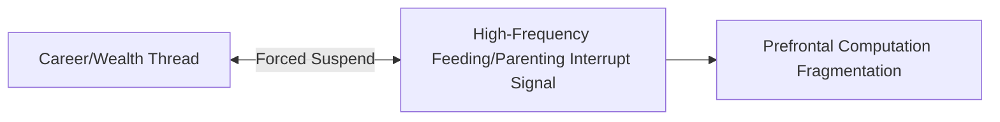
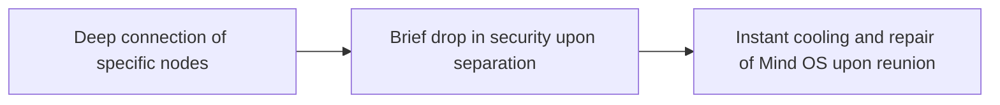

In the grand narrative meticulously woven by the secular matrix, "true love" and "marriage" are routinely peddled as the ultimate salvation—the terminal station of human existence. Countless individuals, driven by loneliness or anxiety, impatiently plug another independent entity into their personal life network.

However, when viewed through the rigorous underlying logic of **System Theory of Mind** and **Cognitive Decoupling**, money is merely an external operating parameter. Intimacy, on the other hand, is the most complex and high-risk "third-party software integration" your system will ever attempt to load in its lifetime.

If your Mind Operating System (Mind OS) has not yet completed its formatting and decoupling, the consequences of a blind grid-tie integration are severe. By default, your system will likely degrade into a **"dissipative system"**—a highly inefficient structure that consumes massive amounts of psychological bandwidth, time, and fiat assets just to maintain a fragile internal balance, all while failing to output any positive value to the external world.

What follows is a cold, neutral, and meticulously detailed system-level engineering guide to intimate relationships.

## I. The Dissipative System: A Grid-Tie Disaster for the Under-Resourced

For the average individual who has not yet achieved financial freedom or cognitive independence—lacking sufficient "redundant computing power" and a "risk isolation buffer"—traditional marriage and intimacy often trigger severe system drag. This typically executes a negative synergy loop where **1 + 1 < 2**.

### 1. Structural Paralysis and the Flux of Replacement Costs

In a family system lacking massive surplus wealth to act as a "shock absorber," every micro-decision (from chore allocation and consumer choices to social obligations) devolves into a **zero-sum power struggle**.

Because the system lacks clear, authorized leadership, decision-making power quietly drifts toward the node with the lowest "replacement cost"—the individual who possesses more options in the external matrix and can disconnect at any time. This throws the entire architecture into chronic "structural paralysis":

- Nodes with high productivity cannot obtain the absolute authorization needed to drive the system forward.
- Resource-deprived nodes cannot afford the underlying cost of disconnecting and exiting.
- Through prolonged mutual attrition, both parties can neither achieve high-efficiency symbiosis nor execute a graceful hard fork.

### 2. Zero-Sum Internal Friction and Bandwidth Hijacking

Intimate relationships operating without a financial profit margin have an incredibly low fault tolerance. Under resource constraints, **one party's self-investment (e.g., expensive further education, high-risk career transitions) is routinely flagged by the system as a "malicious encroachment" on the other party's survival resources.**

This chronic tug-of-war over resource allocation relentlessly hijacks both parties' prefrontal cortex bandwidth. The core computing power you originally reserved to capture generational dividends and deploy high-dimensional projects in the physical world is entirely consumed by meaningless emotional reconciliation and background synchronization. At this juncture, marriage fundamentally hard-codes the ceiling of your personal growth.

### 3. The Parenting Bottleneck: An Uninterruptible Task Stream

The introduction of a child injects a highly aggressive, **"Non-interruptible Task Stream"** into an already fragile system.

For average households that cannot fully outsource parenting costs via capital, this task stream is absolute and dictatorial. It cannot be paused like a work project, nor can it be delivered in bulk batches. High-frequency, microscopic caregiving spanning several years aggressively slices an individual's contiguous time into unproductive fragments. It forcibly downgrades and locks your Mind OS from a **Proactive Life-Building Mode** into a **Reactive System-Maintenance Mode**.

## II. The Independent Single Phase: A Low-Overhead, High-Efficiency Pure Sandbox

Before deciding to introduce and integrate another node, you must first achieve near-perfect self-sufficiency within your "Single OS." Being single is not a system error; it is a **high-efficiency, low-friction, pure sandbox environment**.

### 1. The Linear Feedback of Concentrated Energy Bodies

In a single state, an individual's energy is locked in absolute "focus." Your decision-making chain is a minimalist, linear structure: **Input Command -> Physical Execution -> Result Feedback -> System Iteration**.

You do not need to burn CPU cycles synchronizing or emotionally reconciling with another node running entirely different internal logic. Over a multi-year span, the gap in wealth accumulation and cognitive evolution between a single, awakened individual running a "low-overhead maintenance" model and a married individual trapped in a "high-dissipation system" will widen by several orders of magnitude. This is rarely a matter of innate talent; it is purely the architectural advantage of Sustained Focus.

### 2. Seeing Through the Cold Reality of Biochemical Dopamine

During the single phase, you must ruthlessly decouple from the concept of "romantic love." From an evolutionary biology standpoint, the brain's frantic secretion of phenylethylamine, dopamine, and oxytocin is fundamentally a **temporary biochemical hijack** executed by your genes to ensure species reproduction.

This powerful biochemical code comes with a strict expiration date, typically receding within **18 to 36 months**. Un-decoupled mortals mistake this for eternal destiny, making lifelong binding commitments at peak dopamine. High-level players, however, view it as a temporarily executed entertainment script. They observe its flux with cold detachment and absolutely refuse to let this irrational third-party code corrupt their core system.

### 3. The "Tiger's Teeth, Saint's Heart" Interaction Protocol

Even when interacting with the external world while single, the decoupled individual runs two advanced security protocols:

- **Cold Compassion:** View everyone around you (including parents and partners) as the "composite output" of their biological genes, childhood vulnerabilities, and underlying social programming. When a node hurts or deceives you, it is akin to being bitten by a snake. You do not need to generate a high-energy-consuming emotion like "hatred." You simply remain neutral, recompile your boundaries, and physically remove yourself from their attack radius. You forgive others not because they deserve it, but because your system needs to free up the RAM monopolized by resentment.
- **Non-Savior Mode:** Never attempt to act as anyone's spiritual guide or savior. Every entity has its own closed causal loop and life code. You may provide neutral support when they are in a quiet state, but you must never replace them in walking their own painful path of system formatting.

## III. High-Level Evolution: Integrated Selfishness and the High-Dimensional Secure Base

If two fully decoupled "independent high-level systems"—who no longer suffer from survival or financial anxiety—decide to execute a deep bind, they will completely discard secular moral extortion and reconstruct intimacy in a higher dimension.

### 1. The Bankruptcy of Pseudo-Selflessness and the Rigid Demand to "Be Needed"

Societal culture heavily promotes a saint-like love that is "purely selfless, expects nothing in return, and merely requires the other to be a good person." However, in the sandbox of cognitive theory, **pure selflessness is a sterile abstraction devoid of emotional flavor.**

If you love someone simply because they are "noble, kind, and correct," rather than because they represent an irreplaceable, **"rigid demand"** at a deeper systemic level, that connection is suspended and freezing cold. Under such saintly observation, your partner will experience a suffocating sense of "not being needed."

True high-level intimacy openly acknowledges the rationality of **Integrated Self-Interest**. I need you not just because you are excellent, but because your existence has become the most inseparable, non-fungible component of my life puzzle and identity.

### 2. Constructing a High-Dimensional "Secure Base"

A high-level grid integration that transcends material auditing and dopamine bonding runs an incredibly stable "Secure Base" protocol. This protocol no longer treats the partner as a "tool" to complete secular tasks, but as a safe harbor for psychological reconstruction. It operates on three clear systemic characteristics:

This is an act of profoundly courageous **Self-Entrustment**. You voluntarily open your system's highest defense privileges to the other party, acknowledging that they possess the capacity to emotionally destroy you, yet you choose to hand over the keys anyway. In exchange, you acquire the deepest, most interference-resistant **Hot Standby** system available in the entire desolate secular matrix.

### 3. The Dialectic of "Us" and System Ascension

In the ruins where dopamine has completely burned out, two decoupled individuals begin to architect a true, long-term sovereign union. The independent "I" voluntarily dissolves within a rational consensus, reassembling into a higher-order, more stable system label: **"Us."**

This dissolution is absolutely not the compromise of a weak node losing its identity; rather, it is an ascension experiment in the life sandbox, initiated by strong entities who have seen through the illusion of ego. Within this collective, the dividend of absolute trust completely annihilates all synchronization friction and transaction costs. They act as mirrors for each other, continuously patching their system bugs through mutual observation, ultimately achieving shared cognitive ascension.

## IV. System-Level Benchmarking of Three Intimacy Architectures

| **Evaluation Dimension** | **Dissipative System (Average Secular Marriage)**            | **Concentrated Energy Body (High-Level Single)**             | **High-Dimensional Secure Base (Hot Standby)**               |
| ------------------------ | ------------------------------------------------------------ | ------------------------------------------------------------ | ------------------------------------------------------------ |
| **System Sync Cost**     | **Extremely High.** Background RAM is choked daily by communication friction and emotional auditing. | **Zero.** Linear decision-making; commands reach the physical layer directly with precise feedback. | **Extremely Low.** Deep tacit understanding and underlying consensus eliminate almost all sync overhead. |
| **Risk Resilience**      | **Extremely Low.** Lacks financial and cognitive buffers. Any external error triggers violent internal oscillation. | **Medium.** Armed and self-sufficient, but lacks backup support during critical system crashes. | **Extremely High.** Perfect Hot Standby mechanism; if one side crashes, the other instantly assumes control. |
| **Core Evolution Rate**  | **Severely Anchored.** Computing power is hijacked by high-frequency trivialities and reactive system maintenance. | **Extremely Fast.** 80% of prefrontal computing power is fully dedicated to self-iteration and project deployment. | **Exponential Ascension.** Built on a secure foundation, dual computing power reorganizes to launch a dimensional strike on the external matrix. |

## Final Underlying Insight

In this ultimate third-party software integration known as intimacy, there is no middle ground.

If you are still unable to silence the background error noises in your brain triggered by "lack of money, lack of validation, or fear of loneliness," then remaining single is the only correct architectural choice to keep your system from collapsing under the weight of entropy.

**Do not load a high-energy-consuming dissipative system when you are critically short on redundant computing power. Above all, never surrender your precious system Root access while under a biochemical dopamine hijack.**

Only when you can autonomously run a state of ultimate clarity and abundance out in the wasteland do you truly qualify to select another god-tier node—and jointly boot up that fearless, defenseless, mathematically indifferent, high-dimensional life sandbox experiment.
