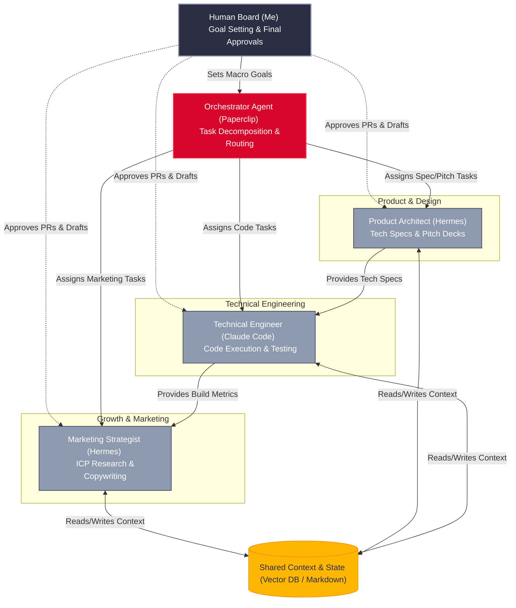

Scaling a software product used to require a massive tradeoff. If you were a full-timer with an itch to launch your own startup, you faced a brutal reality: either sacrifice your weekends and risk burning out to write every line of code yourself, or raise capital early just to hire a team you aren't ready to manage.

I chose a third path.

I am still a full-timer. I haven't quit my day job yet. But behind the scenes, I have already built the operational infrastructure of a highly functional, multi-department enterprise. I don't have human co-founders or employees. Instead, I have spent the last few months architecting an autonomous, AI-driven organization that builds my product, drafts my pitch proposals, and executes my marketing strategies while I sleep.

By the time I officially transition to a solo founder, my company won't just be a prototype—it will be a fully functional machine. Here is the exact stack, architectural framework, and workflow I use to run an autonomous product ecosystem.

## 1. The Operational Engine: Paperclip + Hermes + Claude Code

To build a zero-human company, you have to move past standard chatbot windows. If you are juggling 20 different browser tabs of various AI models, you don't have a system; you have a mess. You lose context, state resets upon reboots, and you waste precious cognitive energy acting as a manual copy-paste router between tools.

An autonomous agent ecosystem requires three core pillars to function:

* **Role Definition & Persona:** A highly specific system prompt that outlines objectives, boundaries, tone, and standard operating procedures.
* **Tool Access (Tooling/APIs):** Agents cannot just generate text; they must interact with the world. I grant them access to read/write to databases, execute code in sandboxed environments, call web APIs, scrape websites, and send communications.
* **State & Memory Management:** Agents utilize a combination of vector databases for long-term semantic memory (historical contexts, brand guidelines, past decisions) and structured databases for short-term operational state tracking.

My setup treats AI agents like engineering resources, organized under a single management plane. I use three core technologies to handle this:

* **The Orchestration Layer (Paperclip):** This is the operational backbone. It operates like an issue tracker (resembling a clean, data-driven dashboard like Linear). It allows me to define a company structure, establish high-level business goals, map out an organizational chart, and enforce strict token budgets so agents don’t run into infinite loops.
* **The Autonomous Operator (Hermes Agent):** Powered by deep, persistent memory, a vast suite of terminal/web tools, and excellent function-calling capabilities, Hermes acts as my senior strategist, researcher, and product manager within the orchestration layer. It remembers context across sessions and coordinates high-level tasks.
* **The Execution Powerhouse (Claude Code):** When it comes to deep code exploration, writing complex backend modules, and executing local testing suites inside my codebase, I connect Claude Code as the primary agentic engine for my engineering department.

By sitting these tools inside an organization-aware framework, tasks inherit full contextual history. The engineering agents know *why* they are building a feature because they can trace the assignment back to the parent business goal.

## 2. Modeling the Pre-Launch Org Chart

Because my time is constrained by my primary job, I have mapped out specialized digital roles inside my management dashboard. Every agent has a distinct system persona, target metrics, and strict boundaries.

Here is the exact architecture of my digital organization:

While the high-level chart routes tasks across three main agent pillars, these pillars spin up highly specialized sub-agent routines to execute specific operational workflows:

### The Product & Engineering Pillar (Claude Code & Hermes)

In a traditional startup, engineering is the biggest bottleneck and the highest expense. My engineering loop handles everything from feature ideation to continuous deployment:

- **The Product Manager Routine:** Analyzes user feedback logs and system performance metrics to draft comprehensive software requirement documents.
- **The Architect Routine:** Breaks down the requirements into modular system designs and selects the optimal database schemas or API endpoints.
- **The Developer Routine:** Swaps to Claude Code to write the functional code inside a secure, containerized sandbox environment.
- **The QA & Code Review Routine:** Attempts to break the code, runs automated test suites, checks for security vulnerabilities, and passes bugs back with explicit error logs until the code passes all checks.

### The Growth & Marketing Pillar (Hermes)

Marketing requires consistent execution and rapid data analysis. This department runs continuously, optimizing campaigns in the background:

- **The Trend Analyst Routine:** Scrapes industry forums, social feeds, and search engine data to identify emerging customer pain points and trending keywords.
- **The Content Strategist Routine:** Takes those insights and drafts hyper-targeted content outlines, social media campaigns, and email sequences.
- **The Optimization Routine:** Monitors live analytics (click-through rates, conversions) and runs programmatic A/B tests on landing page copy to maximize conversions.

### Backend Infrastructure Operations

To prepare for post-launch automation, I have already pre-configured sub-agent frameworks to handle corporate housekeeping:

- **The Operations Guard:** Features a **Bookkeeper Routine** to reconcile sandbox invoice logs and a **Compliance Routine** that scans updated regional regulatory frameworks to ensure our user agreements stay up to date.
- **The Customer Experience Core:** Features a **Triage Routine** to parse incoming technical support tickets and a **Resolution Routine** to look up internal markdown documentation and propose empathetic solutions.

## 3. The Lifecycle of an Autonomous Cycle

Because I work a demanding full-time job, I rely on a structured execution loop. I do not micro-manage my agents. I issue a high-level goal before I start my workday, and the multi-agent system orchestrates the execution autonomously.

The workflow moves through five distinct phases across product development, proposal pitching, and marketing amplification:

1. **Goal Ingestion [Phase 1 — 5 Minutes]:** I input a macro target into the Paperclip dashboard (e.g., *"Implement JWT-based authentication and generate a security whitepaper for enterprise pitches"*). The Orchestrator accepts the goal, decomposes it into technical and marketing tickets, and checks out the tasks to the respective departments.
2. **Autonomous Engineering [Phase 2 — Headless Execution]:** While I am focused on my primary job, the Engineering department activates. Claude Code modifies the codebase, boots up local server environments to verify routing, and iteratively fixes its own syntax errors until all authentication tests pass.
3. **Collateral & Proposal Pitching [Phase 3 — Cross-Collaboration]:** The Product Architect agent pulls the successful implementation logs from the codebase. It automatically updates our technical pitch deck and writes an enterprise-grade security proposal detailing our cryptographic safeguards, storing the draft inside our shared workspace.
4. **Growth Drafting [Phase 4 — Content Generation]:** The Marketing Strategist agent takes the technical spec and translates it into public-facing content. It builds a detailed blog draft explaining the engineering challenge we solved, tailoring the language to catch the attention of target developers on community platforms.
5. **The Human Gateway [Phase 5 — Review & Push]:** When my workday ends, I open the dashboard. I see a unified, clean pull request, a complete client-ready pitch document, and a formatted marketing draft. I review the metrics, check the token spend logs, and press "Approve" to push everything live.

## 4. Engineering the Communication Protocols

The secret to preventing chaos in a multi-agent company lies in how the agents talk to each other. If you let every agent talk to every other agent without structure, you end up with infinite loops, runaway API costs, and cognitive drift.

I utilize two primary interaction models depending on the complexity of the department:

### Model A: The Hub-and-Spoke (Orchestrator) Model

For departments that require rigid operational structures, like Finance or Engineering, I use an Orchestrator agent. The spokes (specialized sub-agents) never talk to each other directly. They only report to the Orchestrator. The Orchestrator receives the macro goal, breaks it into sub-tasks, assigns them to specific spokes, collects the outputs, evaluates the quality, and compiles the final result. This minimizes token usage and keeps workflows strictly linear.

### Model B: The Choreographed Peer-to-Peer Model

For creative and exploratory departments, like Marketing Ideation, I allow structured peer-to-peer communication. The agents operate in a shared conversation space where they can critique each other's ideas. To prevent this from spinning out of control, I enforce strict deterministic guardrails: every discussion has a maximum turn limit (e.g., 4 rounds of debate), and a designated "Synthesizer Agent" is hard-coded to terminate the conversation and extract the best actionable elements once the limit is reached.

## 5. Engineering Safe Guardrails for the Solo Builder

When you build an autonomous system that operates alongside a full-time job, you have to engineer tight guardrails to prevent chaos, runaway cloud costs, or broken code. Here are the principles I implemented:

### 1. Token Budgets as Financial Firewalls

Every agent inside the orchestration layer is assigned a hard daily and monthly spending limit. If an agent hits a complex logic bug and gets caught in a recursive loop, the platform triggers an atomic checkout failure and freezes the agent once it reaches 80% of its allocation. This ensures I never wake up to an unexpected four-figure API bill.

### 2. Context Window and File Hygiene

Instead of dumping my entire codebase and historical chat logs into the agent's context window—which causes models to lose focus and hallucinate—I leverage a centralized configuration file approach. By keeping core brand guidelines, architectural rules, and API schemas in a highly structured `CLAUDE.md` and `memory.md` file system, the local execution tools ingest the identity layer instantly on every heartbeat without consuming massive token overhead.

### 3. The Power of Idempotency

Because these tasks run asynchronously, every tool and script executed by the agents is built to be idempotent. If a network drop occurs mid-build, the system can pick up exactly where it left off, using persistent session flags to preserve terminal outputs and state history across heartbeats.

## The Ultimate Horizon: Zero-Marginal-Cost Scale

The traditional way of launching a tech company forces you to make a choice between financial stability and execution speed. By stepping into the role of a systems architect rather than a manual solo developer, you change the equation entirely.

Using this multi-agent infrastructure, I am able to maintain the output velocity of a small engineering and marketing team without leaving my job. I am expanding my product, preparing my go-to-market materials, and building out historical documentation completely asynchronously.

If you are a software engineer planning your next move, stop thinking about how many lines of code you can write this weekend. Start thinking about how to build the organizational system that will write them for you.
