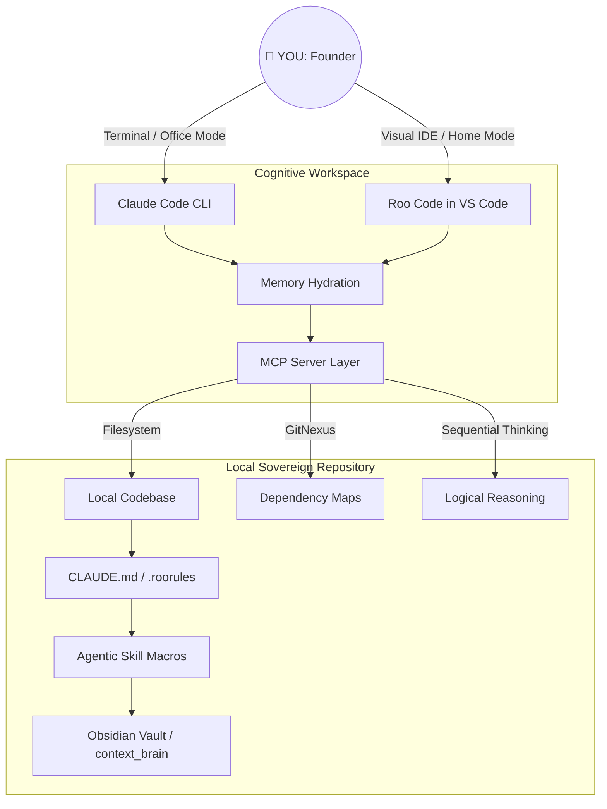

A lot of us in the solo founder community got caught up in the early hype of multi-agent orchestration frameworks like Paperclip and Hermes. We loved the dream: a virtual army of specialized AI agents running our software companies in the background while we slept.

But after putting those heavy frameworks to the test, I hit a harsh reality. Multi-agent orchestration introduces a massive amount of framework overhead. Every background heartbeat, inter-agent message, and context reload burns tokens before a single line of feature code is actually written. For a solo founder spinning up an early-stage SaaS product, this operational ceremony costs far more in tokens, cash, and complexity than it delivers.

I realized I needed to pivot. I stripped out the heavy framework abstraction layers and replaced them with a hyper-flat, token-efficient, Git-durable pipeline: a **Cognitive Engineering Workspace**. I kept the structural org-chart thinking—the mental models of departments, routines, and guardrails—but I now execute them entirely within native developer tooling, bridging my terminal (**Claude Code CLI**) and my visual IDE (**Roo Code**).

If you want to build a real software business with zero orchestration overhead, using nothing but a laptop, a simple codebase, a native `cron` file, and an optimized AI environment, this playbook is for you.


## The Core Philosophy: Framework Minimalism

My strategy is straightforward: Go as flat as possible until your business scale genuinely forces you to orchestrate.

Instead of treating AI as an always-on autonomous employee running in the background, I treat my AI tools as an **on-demand execution engine** that I call in for specific, highly bounded tasks. By moving away from the autonomous agent fantasy, I gained an incredibly low token bill and a bulletproof, predictable developer loop.



### The Lean Replacement Stack

You don't need expensive orchestration platforms to run a virtual enterprise. Every critical operational need maps directly to native, free, or highly optimized developer tools:

| **Legacy Framework Need**     | **Ultra-Lean Replacement**                                   | **Token & Financial Cost**                                 |
| ----------------------------- | ------------------------------------------------------------ | ---------------------------------------------------------- |
| **Engineering Execution**     | **Claude Code CLI** (Office Mode) & **Roo Code** (Home Mode) | Pay only for actual feature work done.                     |
| **Token Economy / Defense**   | **rtk CLI Proxy** (Demonstrably cuts token consumption by 60–90%) | Massive reductions in command-line overhead.               |
| **Scheduled Async Jobs**      | Native system `cron` + non-interactive CLI calls (`claude -p "..."`) | Near-zero operational overhead.                            |
| **Persistent Context/Memory** | Git-tracked Markdown files + local **Obsidian** Vault        | Free, durable, and version-controlled.                     |
| **Codebase Context / Maps**   | **GitNexus** & **Graphify** for local dependency indexing    | Eliminates long, token-draining recursive directory scans. |
| **Legacy Input Ingestion**    | **MarkItDown** parsing for instant asset conversion          | Cleans up wordy documents into concise markdown specs.     |
| **Budget Discipline**         | Hard spend limits configured directly in the Anthropic Console | Free, bulletproof billing circuit-breaker.                 |
| **Context Bootstrapping**     | Hyper-optimized `CLAUDE.md` in **Caveman Mode**              | Paid once per session, not per background heartbeat.       |


## Designing Your Virtual Org Chart (The OpenGAP Standard)

Even though I don't use active orchestration software, my repository still functions as a virtual company. I follow the **OpenGAP standard**—a framework-agnostic, git-native methodology for defining AI capabilities.

I didn't abandon the org chart; I shifted its execution from expensive background software processes into local, Markdown-driven prompt architectures and explicit system directives.

### When to use Skills vs. Agents

To prevent logic drift and wasted tokens, my workflow draws a strict line between two execution patterns:

- **Skills (Rigid step-by-step macros):** Invoked via slash commands (e.g., `/pr-review`, `/generate-adr`) to execute predictable, repeatable workflows.
- **Agents (Domain-specific roles):** Invoked via `/agents:name` when open-ended, deep contextual problem solving is required.

### The OpenGAP Specialist Directory

When tasks arise, I route them directly to specialized, role-framed worker profiles stored in `.claude/agents/`:

- **`backend-specialist`:** Deep expertise in models, core services, CQRS, queue jobs, and multi-tenancy.
- **`frontend-specialist`:** Masters of component development, Inertia.js, React, and Tailwind CSS form patterns.
- **`test-writer`:** Focused completely on test patterns, data isolation, and feature vs. unit splits.
- **`migration-specialist`:** Enforces database safety rules, explicit schema changes, and robust rollback plans.

> **The Communication Protocol (Rigid Hub-and-Spoke):** Specialist sub-agent configurations *never communicate with one another directly*. I act as the single source of truth and coordination hub. The AI handles exactly one task at a time, writes its output clearly to the workspace, and terminates the session.


## Infrastructure: The Model Context Protocol (MCP)

To execute this safely without a heavy orchestration framework, I use native **Model Context Protocol (MCP)** servers. This allows the AI to safely inspect my workspace, run tools, and reason sequentially without human hand-holding.

My `.claude/mcp.json` relies on native, lightweight local tools:

```json
{
  "mcpServers": {
    "gitnexus": {
      "command": "gitnexus",
      "args": ["mcp"]
    },
    "filesystem": {
      "command": "npx",
      "args": ["-y", "@modelcontextprotocol/server-filesystem", "/Users/yourname/dev/product-repo"]
    },
    "sequential-thinking": {
      "command": "npx",
      "args": ["-y", "@modelcontextprotocol/server-sequential-thinking"]
    }
  }
}
```


## System Configuration Blueprints

Because Claude Code evaluates `CLAUDE.md` and the `.claude/` directory structure natively at session initialization, the system automatically picks up my engineering preferences and constraints without needing external orchestration code.  

Here is exactly how I structure my local entry files to enforce hyper-concise token constraints.

### 1. The Master Entry Point (`CLAUDE.md`) in Caveman Mode

To maximize token efficiency, I enforce **Caveman Mode**—a constraint that strips all conversational fluff, narrative summaries, and pleasantries from the AI's responses.

```markdown
# CLAUDE.md

## Caveman Mode (Token Optimization)
Communicate efficiently. Omit pleasantries, filler words, and narrative summaries. Use terse, imperative directives.

## Rule Files
@.claude/rules/architecture.md
@.claude/rules/security.md
@.claude/rules/compliance.md

## Project Overview
**What it is:** [one sentence]
**Stack:** [language, framework, database, libraries]
**Systems:** [main modules]

## Commands
# Start: php artisan serve
# Test:  php artisan test
# Lint:  vendor/bin/pint

## Golden Invariants
- Never use standard floats for financial calculations. Use brick/math wrappers.
- Verify GitNexus dependency blast radius maps before refactoring core models.
```

### 2. The Enforcement File (`.claude/rules/compliance.md`)

To keep my app airtight, I enforce strict domain policies directly inside my rule-set files. This allows me to use specific engineering commands like `/lhdn-compliance-check` to validate code against local statutory guidelines.

```markdown
# Invariant Compliance Directives

## Financial Data Precision
- All currencies must be processed inside decimal value wrappers.
- Floats are structurally banned from billing services due to precision drop errors.

## Statutory Calculations (LHDN & SOCSO)
- Payroll thresholds must match the current fiscal year caps.
- SOCSO/EIS contributions must utilize banded lookup tables instead of flat-percentage multiplications. 

## Transaction Routing
- Single transactions ≥ RM10,000 must immediately flag an `INDIVIDUAL_REALTIME` submission state.
- Consolidated pipelines are strictly restricted to transactions below RM10,000.
```


### Setting Up Financial Circuit-Breakers

Do not expect your code to monitor its own token spend. Log into the **Anthropic Console** and hard-code your protection gates directly:

- **Spend Alerts:** Set an automatic alert trigger at 80% of your expected monthly budget to catch unexpected coding loop loops early.
- **Hard Cap Limits:** Force an absolute termination gate at 100% of your monthly budget allocation. If an automated night-time cron job gets trapped in an infinite logic loop, the API infrastructure will block further spending before it becomes an expensive mistake.


## My Ultra-Lean Daily Operating Loop

Without an orchestration framework automatically moving tickets, my efficiency relies on a clean, low-friction terminal routine backed by **rtk** token defense.

### Step 1: Ingestion & Impact Assessment

I never feed raw PDF or DOCX client requirements straight to an LLM loop. I clean them first, then check the dependency blast radius:

```bash
# Ingest legacy documentation instantly
markitdown requirement_doc.docx > spec.md

# Compute the technical blast radius before touching code
npx gitnexus analyze
```

### Step 2: Interactive Processing (CLI vs. Visual IDE)

Depending on where I am working, I split my tasks into two modes:

- **🏢 At the Office (Claude Code CLI):** I open my proxy-wrapped terminal session via `rtk claude` to execute explicit engineering workflows with minimal token spend.
- **🏠 At Home (Roo Code in VS Code):** I transition to my visual sidebar panel, utilizing a background-matched custom `gemma-4-26b-a4b-it` profile via an OpenAI-compatible endpoint.

```bash
# Launch token-optimized command line
rtk claude
```

*Inside the terminal shell, I call my OpenGAP agents and skills directly:*

```bash
# Open-ended feature writing using the dedicated specialist agent
/agents:backend-specialist "Implement transaction routing based on spec.md"

# Rigid automated task execution
/lhdn-compliance-check
/generate-adr
```

### Step 3: Local Knowledge Graph Seeding

To prevent "Architectural Amnesia" without burning tokens re-reading the entire codebase each time, I index my repository into a local **Obsidian Vault** using **Graphify**:

```bash
# Index the project codebase for local persistent memory
graphify install --project
graphify claude install
```

I open this `context_brain/` directory inside Obsidian and use the **Dataview plugin** to generate an auto-updating, completely free table of all engineering decisions and structural changes.

### Step 4: Nightly Automated Tasks via `cron`

To manage background auditing, compliance monitoring, or system logs without an expensive framework running 24/7, I rely on my system's native daemon `cron` list. I open my configuration file:  

```bash
crontab -e
```

And add non-interactive execution workflows that run automatically while I am away:  

```bash
# Execute a comprehensive architectural check every night at 2:00 AM
0 2 * * * cd ~/ProductRepo && claude -p "Perform a structural project health check using the instructions in .claude/rules/architecture.md. Write any detected layout violations directly to reports/health.log" --no-markdown

# Trigger an automated weekly external compliance crawl check every Sunday evening
0 20 * * 0 cd ~/ProductRepo && claude -p "Review regional statutory sites for recent compliance modifications. Update .claude/memory/decisions.md if updates match our current architecture pattern." --no-markdown
```


## Technical & Deployment Safeguards

When you strip out complex agent orchestration frameworks, you lose their proprietary monitoring dashboards. You replace them with bulletproof, native development pipelines.

### 1. Hardened CI/CD Pipelines

Don't let manual deployments pollute your local state. Let an agent scaffold your configurations, then run automated checks via GitHub Actions before pushing a multi-stage Docker build to production:

```yaml
# .github/workflows/deploy.yml
name: CI/CD Pipeline
on:
  push:
    branches: [ "main" ]
jobs:
  build-and-test:
    runs-on: ubuntu-latest
    steps:
    - uses: actions/checkout@v3
    - name: Set up Environment
      uses: actions/setup-node@v3
      with:
        node-version: 22.x
    - run: npm ci
    - run: npm run test
    - run: npm run build
```

### 2. Managing Workspace State Safely

Because your local development setup runs directly on your codebase, an erratic prompt can occasionally overwrite local structures if it gets confused.

**Commit Clean States:** Always verify that your `git status` is clear before firing off highly complex engineering prompts. If the tool introduces unwanted layout drift, wipe the slate clean immediately:

```bash
git reset --hard HEAD
```


## When to Graduate Back to Orchestration

The ultra-lean flat stack is designed to take you successfully through early development all the way into stable, profitable revenue tiers. Avoid the temptation to install complex agent orchestration systems until you cross explicit complexity thresholds:

1. **Multi-Product Scaling:** You are managing three or more distinct, disconnected software codebases and require isolated API token usage accounting.
2. **Autonomous Execution Volumes:** You have massive, consumer-facing background operational workflows—like automatically processing hundreds of customer customer service tickets or running continuous automated scraping tasks—that justify the baseline token overhead.
3. **Team Governance Needs:** You have expanded beyond a solo setup and have multiple human engineers collaborating in the same repository, where an orchestration layer is necessary to handle workflow governance and code review pipelines.

If you are running a core SaaS product generating under RM15k–20k MRR, keep your stack completely flat. Your most valuable company asset isn't a complex, fragile configuration of background agent interactions—it's clean, well-tested, highly optimized code.
