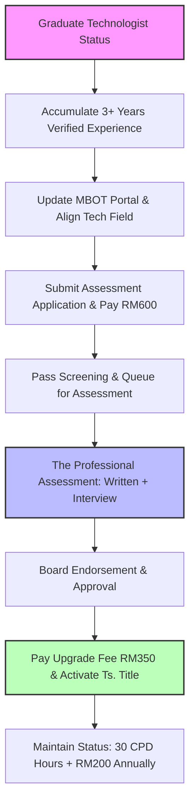

When I first registered as a Graduate Technologist with the Malaysia Board of Technologists (MBOT), it felt like a solid step forward. But deep down, I knew the ultimate goal was the **Professional Technologist (Ts.)** title. It is more than just a couple of letters before your name—it is a formal, legally recognized validation of your technical expertise, leadership, and contributions to the industry under Act 768.

Recently, I went through the entire journey to upgrade my status. I realized along the way that while the information is out there, it is often scattered, and misconceptions can cause unnecessary delays.

If you are a Graduate Technologist looking to fast-track your path to becoming a recognized Professional Technologist, here is the exact roadmap, insights, and strategies I used to navigate the process smoothly.

## The Big Picture: Your Upgrade Roadmap

Before diving into the paperwork, it helps to visualize the entire trajectory. The process is highly structured, moving from experience accumulation to a formal competency evaluation.

## Debunking the Biggest Myth: The Waiting Game

When I started researching, the most common question I encountered was: *"How long do I have to wait after registering as a Graduate Technologist before I can apply for Ts.?"*

**The short answer: You don't have to wait at all.**

MBOT does not measure your eligibility based on the date your Graduate Technologist certificate was issued. Instead, they look at your **cumulative, verifiable working experience** within your specialized technology field.

To apply for the professional upgrade, you need a **minimum of 3 years of relevant working experience**. If you already have three or more years of solid engineering or tech experience under your belt, you can theoretically apply for your professional assessment the exact same day your Graduate Technologist registration is approved.

### Step 1: Portal Cleanup and Strategic Document Framing

Your upgrade journey lives and dies by the quality of your documentation. When you log into the MBOT member portal to trigger your upgrade, the secretariat isn't just looking at a checklist; they are evaluating your career trajectory.

Because my background is heavily rooted in software systems and engineering leadership, my application fell under the **Information & Computing Technology (IT)** pillar. Whatever your pillar is, you need to frame your experience to match it perfectly.

#### How I Structured My Profile For Maximum Impact

When updating your profile and resume in the portal, avoid writing vague, high-level summaries. The Technology Expert Panel (TEP) wants to see concrete evidence of your technical depth and decision-making capabilities.

- **Focus on Ownership:** Instead of writing *"Responsible for software development,"* I framed it as *"Led the architectural design, system optimization, and end-to-end deployment of scalable cloud infrastructure."*
- **Highlight Technical Problem-Solving:** Clearly articulate complex technical hurdles you faced and how you overcame them. Mention specific frameworks, engineering methodologies, and protocols you implemented.
- **Demonstrate Scope of Leadership:** Even if you aren't a formal manager, show how you mentor junior developers, drive code quality standards, run technical sprint planning, or manage vendors. MBOT needs to see that you are operating at a *professional* leadership level, not just executing tasks.

### Step 2: The Professional Assessment Application

Once your profile is meticulously updated, you will apply for the **Professional Assessment**. This is the formal gatekeeping phase, and it requires a non-refundable payment of **RM 600**.

> **Pro-Tip on Delays:** The single biggest bottleneck in the fast-track process is document rejection. If your project logs are incomplete, or if your employment verification letters lack clear details about your technical responsibilities, the secretariat will send your application back for amendments. This can push your timeline back by weeks or even months. Double-check every upload before hitting submit.

### Step 3: Conquering the Two-Part Professional Assessment

Once your application passes initial screening, you will be scheduled for the actual assessment. This is where many applicants get anxious, but if you understand the format, you can prepare with confidence. The assessment splits into two distinct components:

#### 1. The Written Assessment

This is typically conducted online and evaluates your foundational understanding of engineering/tech ethics, industry regulations, and safety standards in Malaysia.

- **What to study:** Do not ignore **Act 768 (Technologists and Technicians Act 2015)**. Understand MBOT’s code of professional ethics, the legal liabilities of a professional, and general workplace safety guidelines (such as OSHA principles).
- **The Mindset:** They are assessing whether you can be trusted to uphold the integrity of the profession. Answer questions with safety, ethics, and regulatory compliance at the forefront of your logic.

#### 2. The Professional Interview

This is a live session (often virtual, but sometimes in-person) with a panel of appointed Technology Experts (TEPs) from your industry. Think of this less like a stressful job interview and more like a peer-to-peer technical defense.

- **The Presentation:** You will likely be asked to present a summary of your key technical projects. Focus heavily on *your* direct contribution. Use diagrams, system architectures, or workflow flowcharts to explain complex concepts cleanly.
- **Fielding Technical Questions:** The panel will probe your technical decisions. If you chose a specific database structure or system architecture, be ready to defend *why* you chose it over alternatives.
- **The Soft Competencies:** They will also ask about how you handle conflicts in technical teams, how you manage project risks, and how you ensure environmental or data sustainability in your deployments.

### Step 4: Final Approval and Activating the Title

After you clear the assessment, your results are compiled and tabled before the Board for official endorsement. Once the Board approves your status, you will receive a notification in the portal.

To cross the finish line and officially claim your title, you must submit a formal upgrade application through the portal and pay a registration fee of **RM 350**.

Once processed, your status updates to **Professional Technologist**. You are officially authorized to:

1. Use the prefix **Ts.** before your name (e.g., *Ts. John Doe*).
2. Use the post-nominal letters **P.Tech** followed by your specialization (e.g., *P.Tech (Information & Computing Technology)*).

## The Financial Investment Breakdown

To keep your expectations realistic, here is the total financial commitment required to obtain and protect your title:

| **Phase / Expense Type**         | **Cost** | **Frequency** | **Nature of Fee**                                  |
| -------------------------------- | -------- | ------------- | -------------------------------------------------- |
| **Professional Assessment Fee**  | RM 600   | One-time      | Required to sit for the evaluation.                |
| **Title Registration & Upgrade** | RM 350   | One-time      | Required to activate your Ts. status post-passing. |
| **Annual Renewal Fee**           | RM 200   | Annually      | Required to keep your professional license active. |

### Keeping the Title Alive: The Lifelong Commitment

Getting your Ts. title is a massive milestone, but it is an *evergreen commitment*. You cannot simply earn it and forget it. To renew your license every year, you must satisfy two strict conditions:

1. **Pay the RM 200 Annual Renewal Fee.**
2. **Accumulate 30 CPD (Continuing Professional Development) Hours.**

MBOT takes CPD hours very seriously to ensure that Professional Technologists remain at the cutting edge of industry changes.

### How I Safely Secure My 30 CPD Hours Every Year

Don't let the 30-hour requirement overwhelm you. You don't need to spend thousands of ringgit on expensive courses to hit this target. You can rack up hours naturally through your normal professional activities:

- **Attending Tech Conferences & Webinars:** Participating in industry seminars, tech talks, or platform upgrade webinars (AWS, Google Cloud, Microsoft, etc.) counts directly toward your hours.
- **Professional Certifications:** Completing industry-recognized technical certs or specialized technical courses yields a high block of CPD hours.
- **Giving Back (Mentorship & Presenting):** If you conduct a technical sharing session within your engineering department, speak at a local tech meetup, or publish a technical article, you can claim CPD hours under the contribution/presentation categories.
- **Academic/Self-Study:** Formal postgraduate studies or structured online learning paths can also be claimed, provided you maintain certificates of completion or proof of attendance.

## Forget to Renew or submit your CPD hours?

If life gets crazy, you get buried in sprints, or you simply forget to submit your CPD hours, don’t panic immediately—but don't sleep on it either. MBOT has a very specific "safety net," but if you cross a certain line, it becomes a massive, expensive bureaucratic headache.  

Here is exactly what happens if you miss your CPD hours or forget to renew your status.

### Phase 1: The 12-Month Grace Period (The Safety Net)

Missing your deadline doesn't mean your title vanishes overnight. Under MBOT guidelines, all professional registrants are given a **12-month grace period** from the exact date your certificate expires.  

- **Your Status:** Your registration is technically lapsed/expired, but you are not kicked out yet.  
- **What you must do:** You have these 12 months to scramble, accumulate your required **30 CPD hours**, log them into the portal, and pay your **RM 200 renewal fee**.  
- **The Catch:** Remember that CPD hours **cannot be carried forward** from previous cycles. If you had 50 hours the year before, the extra 20 hours wiped clean when your new cycle started. You must earn a fresh batch of hours.  

### Phase 2: Past 12 Months? De-Registration (The Bad News)

If 12 months pass and you *still* haven't renewed or completed your CPD hours, the Board officially triggers **Section 25(1) of Act 768**.  

- **Removal from the Register:** You are officially **De-Registered** and stripped from the MBOT directory.  
- **Legal Prohibition:** You are strictly **prohibited from using the "Ts." prefix or "P.Tech" post-nominal title** in any business, email signature, resume, or name card. Under Act 768, representing yourself as a Professional Technologist when you are de-registered carries legal liabilities.  
- **Notification:** MBOT will issue a formal notice of removal to you within 7 days of the board order.  

### Phase 3: Want it Back? The Re-Registration Gauntlet (The Expensive News)

If you get de-registered and later decide you want your **Ts.** title back, you cannot simply log in, pay a late fine, and call it a day. You are treated almost like a brand-new applicant and have to go through the **Full Re-Registration Process**.  

Here is what the "oops, I forgot" penalty actually looks like:  

| **Step**                      | **Action Required**                                          | **Cost / Consequence**       |
| ----------------------------- | ------------------------------------------------------------ | ---------------------------- |
| **1. Re-application**         | Fill out a formal Re-Registration form and submit a completely updated CV. | High effort.                 |
| **2. Professional Vouching**  | You must find an **active, registered Ts. peer** to review and verify your experience and documents. | Social awkwardness.          |
| **3. The Assessment Penalty** | You must pay the full **Professional Assessment Fee again**. | **RM 600** (Non-refundable). |
| **4. Panel Review**           | Your case goes back to the Technology Assessor Panel for formal qualification review and Board deliberation. | Waiting game restarts.       |
| **5. Title Re-activation**    | Once endorsed and approved by the Board again, you have to pay the registration fee to activate it. | **RM 350**.                  |

> **The Reality Check:** Forgetting to handle your renewal within the 12-month grace period turns a simple **RM 200 yearly renewal** into a **RM 950 financial penalty** plus a complete restart of the bureaucratic review process.  

### How to Avoid the Trap

To protect your hard-earned title, make it a habit to log your activities incrementally. If you attend a 1-day tech conference, log those 4–6 CPD hours into the `cpd.mbot.org.my` portal right that weekend rather than waiting for the end of the year. Think of the 12-month grace period as an emergency brake, not a standard extension line!  

## Final Thoughts

The journey from a Graduate Technologist to a Professional Technologist is a highly rewarding process that challenges you to look at your daily engineering work through a lens of high-level accountability, ethics, and leadership.

If you have the three years of experience ready, don't stall. Clean up your project portfolios, focus heavily on framing your technical ownership, and take the leap. The professional recognition and the doors it opens across the Malaysian tech ecosystem are well worth the effort.
