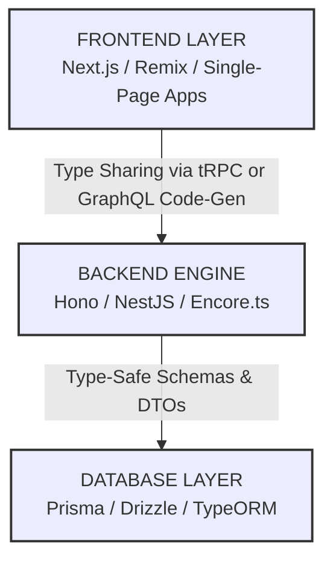
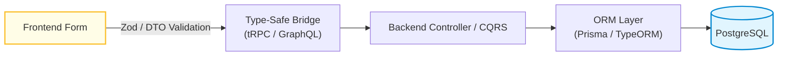
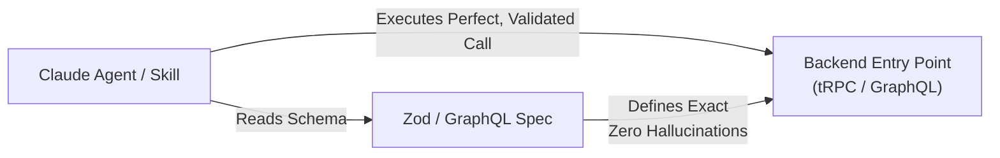

Remember the dream of MeteorJS?

Years ago, Meteor promised us a magical world: one language across the entire stack, real-time data-binding by default, and frontend/backend communication that felt instant without manually writing API client code. It felt like cheating.

But as the web grew, Meteor faded. It relied on a custom ecosystem, heavy data polling, and a monolithic lock-in that didn't scale well for modern cloud architectures. We went back to our silos: separate frontend apps, separate backend APIs, a mountain of manual fetch requests, and hours spent writing matching types on both sides.

I wanted that Meteor magic back, but built for the modern cloud.

After deep-diving into the modern ecosystem, I have put together a unified, fully type-safe TypeScript full-stack architecture. It gives you the seamless developer experience of a single platform while using production-ready, highly scalable modern tools.

Here is exactly how to build it, how the pieces fit together, and how this blueprint can fundamentally change the way your team ships web apps.

## 🏗️ Architectural Philosophy: The Three Pillars

Before looking at the tools, we need to understand the core mission. This stack is designed around three non-negotiable rules:

1. **Write Once, Type Everywhere:** If you change a database column, a query schema, or a backend API route, the frontend must immediately know about it. If it breaks, the compiler should tell you during development—not the user in production.
2. **Zero Manual Client Generation:** Stop writing manual `fetch('/api/users')` or maintaining bloated, hand-crafted `Axios` clients. The network layer should feel entirely invisible.
3. **Modular Monolith (The Monorepo):** Keep everything in a single repository for maximum speed and code sharing, but ensure boundaries stay cleanly separated so you can deploy microservices, edge workers, or traditional servers independently.

## 🛠️ Deep Dive: Choosing Your Flavor (Lean Edge vs. Enterprise Titan)

Full-stack type safety isn't a one-size-fits-all framework. Depending on your team's size and product complexity, you can implement this philosophy using two distinct strategic paths.

### 1. The Database and Data Modeling Layer

At the very bottom sits **PostgreSQL**, the gold standard for relational data storage. To interact with it without losing our minds, we couple it with a type-safe database mapping layer:

- **The Lean Edge Approach (Prisma / Drizzle):** **Prisma** acts as the developer-experience champion by automatically generating TypeScript types directly from a unified `schema.prisma` file. Alternatively, **Drizzle ORM** lets you write code that looks like raw SQL while remaining completely type-safe with zero runtime overhead.
- **The Enterprise Titan Approach (TypeORM + Strict Migrations):** For highly complex domains, **TypeORM** paired with explicit entity definitions and decoupled, programmatic database migrations provides a robust, battle-tested data persistence layer that integrates flawlessly into OOP architectures.
- **The Input Gatekeeper (Zod / Class-Validator):** To ensure data entering our system matches our types, we pair the data layer with validation engines like **Zod** or NestJS **DTOs**. These catch runtime errors at the door and seamlessly export compile-time types to the rest of the application.

### 2. The Backend Routing Engine

Your server architecture must match your operational scale and deployment targets:

- **The Lightweight Routers (Hono / Encore.ts):** **Hono** is a blazing-fast framework designed to run anywhere—traditional Node.js, Cloudflare Workers, or edge networks. **Encore.ts** takes it a step further by auto-managing infrastructure and local databases under a unified TypeScript umbrella.
- **The Organized Framework (NestJS + CQRS):** For larger engineering groups, **NestJS** introduces structural rigor via dependency injection. When applications scale out, implementing **CQRS (Command Query Responsibility Segregation)** ensures that data writes (Commands) and data reads (Queries) are handled via decoupled, strictly typed event handlers, avoiding the mess of bloated service classes.

### 3. The Communication Bridge (The "Meteor" Secret Sauce)

How do we connect the frontend and backend without traditional, loosely typed APIs?

- **tRPC (Best for Lean/Edge):** The true successor to the MeteorJS experience. If your frontend and backend live in the same codebase, tRPC lets you import your server's router types directly into your UI. There are no API endpoints to document; you just execute backend functions on the frontend with native IDE autocomplete.
- **GraphQL + Code-Gen (Best for Enterprise Scaling):** If your frontend and backend require looser coupling, or you need to support multi-platform clients, a schema-driven approach using **GraphQL** (complemented by automation tools like `nestjs-query`) is unmatched. By running a watcher script like `graphql-codegen`, your schema changes automatically output fully typed React/Vue hooks or SDK clients on every save.

### 4. The Frontend Presentation Layer

Because our backend is powered by TypeScript, our frontend must match:

- **Next.js or Remix:** Full-stack React frameworks handling server-side rendering (SSR), making your app load incredibly fast and ensuring excellent search engine optimization (SEO).
- **Vite + React/Vue/Svelte:** If you are building a heavy dashboard hidden behind a login wall where public SEO doesn't matter, Vite gives you a blazing-fast development environment for single-page apps (SPAs).

## 🔄 Step-by-Step Data Flow: How it Works

To see the real-world power of this architecture, look at what happens when a user submits an action.

1. **The Input:** A user fills out a secure form on the frontend presentation layer.
2. **Instant Validation:** Client-side validation instantly flags formatting errors right inside the browser before a network packet is ever sent.
3. **The Invisible Network Call:** The UI invokes a communication call. Under the hood, this transmits a network request, but to the developer, it looks like a local asynchronous function execution.
4. **The Server Execution:** The backend receives the request. Because types are structurally shared, the compiler blocks deployment if the incoming data payload contracts don't perfectly align.
5. **Database Storage:** The server routes the clean data down to the ORM, which safely commits it to the database, eliminating database injection risks entirely.

## 🔑 Security, Authentication, and Testing

A production-grade app cannot rely on data typing alone. We need real security and testing tools.

- **Authentication:** We use modern, robust identity providers like **Clerk** or **Auth.js**. They handle user logins, passwords, social sign-ins, and multi-factor authentication seamlessly, giving us secure user tokens on both the client and server.
- **Testing:** To make sure nothing breaks when we add new features, we use **Vitest**. It is a modern replacement for older tools like Jest. It runs our tests in parallel at lightning speeds, picking up our TypeScript configurations instantly without complex setup steps.

## 🤖 The Secret AI Superpower: Claude Skills & Agents

Building a fully type-safe architecture doesn't just benefit human developers—it gives you an incredible advantage when integrating AI agents and LLMs like Claude.

If you want to build a **Claude Agent** or an internal AI assistant that can execute workflows inside your app (like *"generate a monthly sales report"* or *"ban user X"*), a type-safe stack is your secret weapon.

> **Why AI Agents Love This Stack:** When you give an LLM access to tools, it often struggles with parameter hallucination. However, because our architecture uses explicit **Zod Schemas** or strictly generated **GraphQL OpenAPIs**, we can feed these exact definitions directly to Claude as its system "tools."

Claude reads the precise type definitions, knows exactly what variables are required, and generates valid payloads with near-zero errors. The type safety you built for your team doubles as the perfect context window for an automated AI workforce.

## 👥 Streamlining the Team Workflow

To scale this unified codebase across a growing engineering team without running into a chaotic Wild West, you need strict monorepo tooling and CI guardrails:

| **Workflow Stage**         | **Tooling**                       | **Impact on the Team**                                       |
| -------------------------- | --------------------------------- | ------------------------------------------------------------ |
| **Monorepo Management**    | **Nx** or **Turborepo**           | Intelligently isolates your apps and shared core libraries. It caches builds locally and in the cloud; if nobody touched backend code, CI skips rebuilding it, keeping PR check times under 2 minutes. |
| **Local Quality Control**  | **Git Hooks (Husky) & Commitzen** | Automatically enforces clean code styling via linters and structures a highly readable, standardized commit history (`yarn cz`) before code is pushed. |
| **Continuous Integration** | **GitHub Actions**                | Executes strict type-checking (`tsc --noEmit`) across the entire repository. If an engineer introduces a breaking schema change, the build immediately flags the exact line it impacts. |

### The "No-Break" Branch Strategy

With a unified architecture, your codebase stability sky-rockets. When a developer submits a Pull Request that alters a database property or API contract (e.g., changing `firstName` to `givenName`), the CI pipeline instantly fails if the frontend isn't updated in tandem.

This naturally breaks down engineering silos. Frontend and backend developers can seamlessly pair-program within the same repository, or full-stack engineers can ship complete end-to-end features in a single, atomic commit without risking integration friction later.

## 💡 Key Takeaways

Building this system proves you don't need a heavy, proprietary framework to get a unified full-stack experience. By combining independent, best-in-class tools inside a managed monorepo, you achieve something vastly superior:

- **No More API Guesswork:** You never have to guess what data an endpoint returns or look at outdated documentation tools. You just press dot (`.` ) on your keyboard, and your IDE displays the exact data fields available.
- **Refactoring is Free:** Rename a property in your schema, and the TypeScript compiler will instantly flag every single file across your apps and libraries that needs a fix. You can safely refactor an entire application in seconds.
- **Unbeatable Scalability:** You get the rapid shipping velocity of old-school full-stack frameworks, but your app runs on highly optimized, decoupled systems capable of scaling to millions of users.

By unifying your architecture under a single language and letting tools handle the structural plumbing, you can spend less time fighting your codebase and more time shipping features that matter.

I would love to hear your thoughts on this architecture!

- Are you leaning toward a lightweight **Edge Stack (Hono + tRPC + Drizzle)** or an **Enterprise Titan Stack (NestJS + GraphQL + TypeORM)**?
- How is your team currently handling data sharing between isolated codebases?
- Do you have questions about setting up **automated code-generation** or **monorepo boundaries**?

Let me know what you want to explore next, and we can dive deep into the setup configurations!
