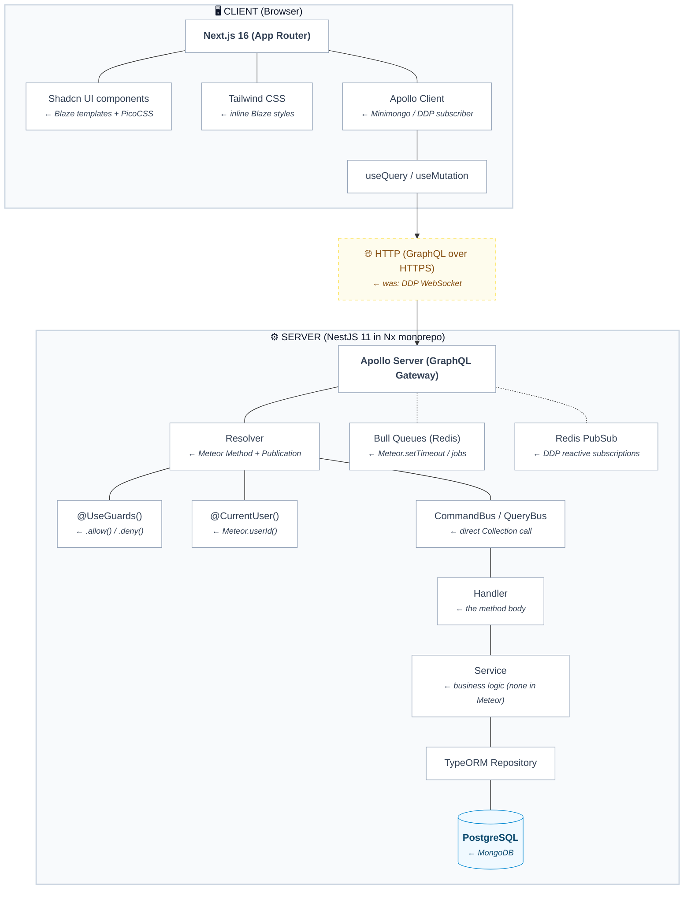

## What This Part Covers

- Why Meteor's "it just works" approach breaks at scale
- The single philosophy shift that unlocks enterprise thinking
- A complete, annotated concept translation table
- A map of the full stack you are about to build
- Why each technology was chosen over the alternatives

No code yet. This part is all mental model — the most valuable 30 minutes in the entire series.


## 1. The Problem With Magic

If you have built something with Meteor + Blaze, you know the feeling: three files, one command, and suddenly you have a real-time reactive app running in the browser. It is genuinely impressive. The framework makes dozens of decisions for you before you write a single line:

- Data syncs automatically between server and client (DDP)
- The database is accessible from both sides of the app
- User sessions are tracked globally with `Meteor.userId()`
- Published data flows into subscriptions without any HTTP layer
- Collections insert, update, and delete with one-liners

This is Meteor's superpower — and its ceiling. Every one of those automatic decisions is a constraint you eventually hit.

### Where It Breaks

**Problem 1: Hidden complexity accumulates.**
When you call `TasksCollection.insertAsync()` from a Blaze template event handler, where exactly does the data go? It calls a method? Directly to the DB? Through a permission check? In Meteor's insecure prototype mode, it goes directly to MongoDB. That's fine for a tutorial. In production, that same simplicity becomes an attack surface: any client can call `TasksCollection.remove({})` unless you remember to add `.allow()` rules.

**Problem 2: Everything is coupled.**
Meteor's isomorphic model means your client code and server code share the same module space. This feels productive at first. At scale it means you cannot deploy the frontend and backend independently, cannot enforce strict API contracts, and cannot add a second frontend (a mobile app, an admin portal) without significant refactoring.

**Problem 3: No explicit request lifecycle.**
When a user submits a form in Blaze, the path from UI event to database write is: `event handler → Collection.insertAsync()`. There is no visible middleware, no validation layer, no service boundary. Adding business logic means scattering `if` statements across the handler or the method body. Adding tests means fighting Meteor's global state.

**Problem 4: MongoDB's schema-less nature becomes a liability.**
A document that says `{ text: "Buy milk", checked: false }` today can silently become `{ txt: "Buy milk", isChecked: false }` tomorrow. No migration. No schema enforcement. No type safety from the database layer up.

None of this is Meteor's fault — it was designed for rapid prototyping and real-time apps. These limitations are deliberate trade-offs. But they are exactly the constraints that prevent Meteor from being used in a serious enterprise environment.

## 2. The One Principle That Changes Everything

Enterprise software is built on one principle:

> **Explicit over implicit.**

Every decision Meteor makes for you — you make yourself, in code, where it is visible, testable, and changeable.

This sounds like more work. It is, slightly, at the start. But consider what you gain:

Think of it like switching from a company where everyone "just knows" the unwritten rules, to one where every department has a written job description on the wall. The adjustment feels bureaucratic for the first week. After that, any new hire can understand the whole system in an afternoon.

| Concern | Meteor (Implicit) | Enterprise NestJS (Explicit) |
|---------|-------------------|------------------------------|
| Who can write data? | `.allow()` rules (forgotten, bypassed) | `@UseGuards(AuthJwtGuard)` on every mutation |
| What shape is valid? | `check(text, String)` (optional) | `class-validator` on every DTO, globally enforced |
| How does data flow? | Framework does it | `Resolver → Bus → Handler → Service → Repository` |
| Where is business logic? | Scattered (methods, allow/deny, helpers) | Always in `*.service.ts` |
| What is the API contract? | Implicit DDP | Explicit GraphQL schema (auto-documented) |
| How do you test it? | Fight global state | Mock one file, test one unit |
| How does it deploy? | `meteor deploy` (one process) | Docker containers, scale independently |

The enterprise pattern is not harder to write — it is harder to *learn*. Once you know the pattern, writing a new feature is a repeatable 9-step checklist. Any developer on your team can pick up any module and immediately know where to find the business logic, the validation, the data shape, and the test.

## 3. The Full Architecture

Here is every layer of the stack you are about to build, and the single Meteor concept it replaces:



### The Nx Monorepo Structure

Instead of a single Meteor project directory, you have an Nx monorepo — one Git repo containing multiple applications and shared libraries:

```
enterprise-todo/                    ← was: my-meteor-app/
├── apps/
│   ├── api/                        ← NestJS backend (the server/)
│   │   └── src/
│   │       ├── modules/            ← was: imports/ or server/
│   │       │   ├── auth/           ← was: accounts-base
│   │       │   ├── user/           ← was: users collection
│   │       │   └── todo/           ← was: tasks collection
│   │       ├── migrations/         ← was: nothing (MongoDB = no migrations)
│   │       └── main.ts             ← was: server/main.js
│   ├── api-e2e/                    ← end-to-end tests
│   └── web/                        ← Next.js frontend (the client/)
│       └── src/
│           ├── app/                ← was: client/
│           └── components/         ← was: Blaze templates
└── libs/
    └── contracts/                  ← was: imports/ (isomorphic code)
        └── src/                    ← shared TypeScript types
```

> **Think of the monorepo like this:** An Nx workspace is an **apartment building with strict bylaws**. Each apartment (app) has its own locked front door — `apps/api` and `apps/web` cannot reach into each other's code directly. Shared code travels through the building intercom: `libs/contracts`. The building's alarm system (`@nx/enforce-module-boundaries`) triggers the moment anyone tries to climb through a window instead.

The critical insight: `apps/api` and `apps/web` are **separate processes**. They communicate only through a defined API contract — the GraphQL schema. This means:
- You can deploy the backend without touching the frontend
- You can add a mobile app that uses the same API
- A bug in the frontend cannot corrupt the backend
- The backend can be tested without any browser

### The Layers at a Glance

Before diving into the translation tables, fix these analogies. You will encounter every one of them in the code — lock in the mental model now and every code pattern in later parts will click immediately.

| Layer | Real-world analogy | Meteor equivalent | The one rule |
|-------|--------------------|-------------------|--------------|
| **Module** | Department in a company | Flat `imports/` (everything global) | Declares what it owns, borrows, and lends — nothing implicit |
| **Guard** | Bouncer at the club door | `.allow()` / `.deny()` — but at DB layer | Returns `true` or throws. Runs before anything else. |
| **Pipe** | Customs desk at the airport | `check(input, String)` — optional | Validates + transforms input. Rejects bad requests before the handler sees them. |
| **Resolver** | Receptionist at a clinic | `Meteor.methods` entry point | Routes only. Never prescribes. Two lines max. |
| **CQRS Handler** | Message relay / dispatch window | The method body | Receives the message, calls one service method. One line. That is all. |
| **Service** | Doctor | The method body (logic part) | All business logic lives here. Always. Every `if` statement. |
| **Repository** | Librarian | `Collection.find()` / `Collection.insert()` | Only layer allowed to touch the database. Services never query directly. |

> **The clinic story:** A request enters like a patient visiting a clinic. The **bouncer** (Guard) checks your ID at the door. The **customs desk** (Pipe) validates your intake form. The **receptionist** (Resolver) checks you in and routes you to the right room. The **dispatch window** (Handler) forwards the case file. The **doctor** (Service) examines and prescribes. The **librarian** (Repository) retrieves your medical records from storage. Each person does exactly one job. None of them does someone else's job.

## 4. The Complete Concept Translation Table

Every Meteor concept mapped to its enterprise equivalent with the reason for the change:

### Application Structure

| Meteor | Enterprise NestJS | Why the change |
|--------|-------------------|----------------|
| `meteor create my-app` | `npx create-nx-workspace` | Monorepo manages multiple apps + shared libs in one repo |
| `client/` directory | `apps/web/` (Next.js) | Explicit separate app, independently deployable |
| `server/` directory | `apps/api/` (NestJS) | Explicit separate app, independently deployable |
| `imports/` (isomorphic) | `libs/contracts/` | Strict type-sharing with explicit export/import boundaries |
| `public/` | Next.js `public/` | Same concept |
| `.meteor/` | `nx.json`, `project.json` | Nx tracks project config, targets, dependencies |
| `package.json` + `packages.json` | Single `package.json` at root | Yarn workspaces manages all app dependencies from root |

### Data Layer

| Meteor | Enterprise NestJS | Why the change |
|--------|-------------------|----------------|
| `new Mongo.Collection('tasks')` | `@Entity({ name: 'todo' }) class TodoEntity` | Explicit schema enforced at DB and TypeScript level |
| MongoDB document (schema-less) | PostgreSQL row (strongly typed) | Relational integrity, type safety, migrations |
| `TasksCollection.insertAsync({text})` | `repo.save(repo.create(input))` | Explicit operation via ORM, audited, typed |
| `TasksCollection.find({ userId })` | `repo.findMany({ where: { userId } })` | Explicit query with typed filter |
| `TasksCollection.updateAsync(id, {$set})` | `repo.save({ ...entity, ...updates })` | Optimistic update via ORM |
| `TasksCollection.removeAsync(id)` | `repo.softDelete(id)` | Soft-delete preserves audit trail |
| No migrations | TypeORM migrations | Every schema change is versioned, reversible, reviewable SQL |
| `SimpleSchema` (optional) | TypeORM entity + class-validator | Schema enforced in two places: DB + API layer |
| Minimongo (client cache) | Apollo Client cache | Same concept — normalised cache, auto-updates UI |

### Server Logic

| Meteor | Enterprise NestJS | Why the change |
|--------|-------------------|----------------|
| `Meteor.methods({ createTask })` | `@CommandHandler(CreateOneTodoCommand)` | Explicit message routing, independently testable |
| `Meteor.publish('tasks', fn)` | `@QueryHandler(FindManyTodoQuery)` | Explicit query handler, no magic transport |
| Inside a method body | `TodoService.createOne()` | Business logic isolated in service, reusable, mockable |
| `check(input, String)` | `@IsString()` on DTO field | Declarative validation, runs automatically via ValidationPipe |
| `throw new Meteor.Error(...)` | `throw new BadRequestException(...)` | NestJS exception filter maps to correct HTTP/GraphQL error |
| `this.userId` inside a method | `@CurrentUser() user` in resolver | JWT-verified user, injected by Passport guard |
| `Accounts.createUser(...)` | `commandBus.execute(new RegisterCommand(...))` | Explicit command dispatched through CQRS |
| `Accounts.setPassword(...)` | `commandBus.execute(new ResetPasswordCommand(...))` | Same pattern |

### Auth & Security

| Meteor | Enterprise NestJS | Why the change |
|--------|-------------------|----------------|
| `accounts-base` package | Passport.js + JWT strategy | Industry-standard auth library, not framework-specific |
| `accounts-password` | bcrypt + RS256 JWT sign | Explicit implementation, auditable |
| `Meteor.userId()` | `@CurrentUser() user: AccessTokenUser` | Injected from verified JWT, typed |
| `Meteor.user()` | `currentUser.user` | Same, but explicitly typed UserEntity |
| `Roles.userIsInRole(...)` | `@UseGuards(RolesGuard)` | Declarative RBAC, enforced at resolver level |
| `.allow({ insert: fn })` | `@UseGuards(AuthJwtGuard)` on mutation | Guard applied at code level, not collection level |
| `.deny({ remove: fn })` | `ValidationPipe + forbidNonWhitelisted` | Reject unknown fields globally |
| DDP session token | JWT access token (RS256) | Stateless, cryptographically verifiable, multi-service safe |
| Meteor login token in localStorage | JWT in Authorization header | Standard HTTP auth, works across any client |

### Transport & API

| Meteor | Enterprise NestJS | Why the change |
|--------|-------------------|----------------|
| DDP (WebSocket protocol) | GraphQL over HTTPS + optional subscriptions | Standard protocol, works with any HTTP client |
| `Meteor.subscribe('tasks')` | `Apollo useQuery(GET_TODOS)` | Explicit data fetching, no magic sync |
| Reactive data cursors | Apollo Client cache + refetchQueries | Explicit invalidation, predictable updates |
| `Meteor.call('createTask', data, cb)` | `Apollo useMutation(CREATE_TODO)` | Explicit mutation, typed response |
| DDP subscriptions (live data) | GraphQL Subscriptions (Redis PubSub) | Standards-based, scales horizontally |
| Method result callbacks | Promise-based / async-await | Modern JS, composable |

### Frontend

| Meteor | Enterprise NestJS | Why the change |
|--------|-------------------|----------------|
| Blaze templates (`.html` + `.js`) | React components (`.tsx`) | Component model, reusable, testable |
| `{{#each tasks}}` | `{todos.map(todo => <TodoCard />)}` | JSX is just JS — debuggable, composable |
| Reactive variables (`ReactiveVar`) | `useState` + Apollo cache | React's model is predictable and explicit |
| `Template.helpers({})` | Component props + hooks | Same concept, but typed |
| `Template.events({})` | Event handlers in JSX | `onClick={handleCreate}` |
| PicoCSS (global semantic) | Tailwind CSS + Shadcn UI | Utility-first + accessible component library |
| `Session.set/get` | React Context + URL state | Explicit, scoped state management |

### Infrastructure

| Meteor | Enterprise NestJS | Why the change |
|--------|-------------------|----------------|
| `meteor deploy` (Galaxy) | Docker → ECS Fargate / TKE | Container-based, cloud-agnostic |
| Embedded MongoDB | PostgreSQL in Docker → RDS/CynosDB in prod | Production-grade relational DB |
| `Meteor.settings` | `.env` + `ConfigModule` | Standard env var management |
| Galaxy container | AWS ECS Fargate / Tencent TKE | Managed container orchestration |
| No queue system | Bull (Redis-backed job queue) | Async processing: emails, AI jobs, notifications |

## 5. Why Each Technology

You will be asked "why did you choose X over Y?" in every senior interview. Know the answers.

### Why NestJS over Express?
Express is a minimal HTTP library. NestJS is a full framework built on Express (or Fastify) that adds: modules, dependency injection, decorators, CQRS, guards, interceptors, pipes, and a testing module. It enforces structure. A 5-person team writing Express apps produces 5 different architectures. A 5-person team writing NestJS apps produces one.

**Memory hook:** NestJS = one architecture for any team size. Express = as many architectures as developers.

### Why GraphQL over REST?
REST requires multiple round trips for related data (`GET /todos`, then `GET /users/:id` for each). GraphQL lets clients request exactly the shape they need in one query. More importantly: the schema is the contract. Generate TypeScript types from it, and your frontend and backend are always in sync. Apollo's `nestjs-query` integration adds automatic filtering, sorting, and pagination without boilerplate.

**Memory hook:** GraphQL = personal shopper (client orders exactly what it needs, one trip). REST = fixed shelf (take everything or make multiple trips).

### Why PostgreSQL over MongoDB?
MongoDB's schema-less flexibility is exactly the problem at scale. You cannot enforce that every todo has a `userId`. Foreign key constraints, joins, transactions, and migrations are PostgreSQL features that prevent entire classes of bugs. PostGIS adds geospatial support for free. TypeORM generates migrations that let you change the schema safely.

**Memory hook:** PostgreSQL = schema enforced at the database level. MongoDB = trust the application (until you can't).

### Why TypeORM over Prisma?
Prisma is excellent but code-generates a separate client from a schema file. TypeORM uses TypeScript decorators directly on entity classes — the entity IS the schema. `AbstractEntity` and the migration system integrate tightly with NestJS. For teams already in TypeScript, TypeORM feels more natural.

### Why RS256 JWT over HS256?
HS256 uses a single shared secret to both sign and verify tokens. Any service that can verify tokens can also forge them. RS256 uses a private key (only the auth service has it) to sign, and a public key (any service can have it) to verify. In a multi-service architecture, services can independently verify JWTs without ever having the ability to issue them. A compromised downstream service cannot forge auth tokens.

**Memory hook:** RS256 = the king's wax seal. Only the king signs (private key). Anyone can check the seal is genuine (public key). No one can forge it without the signet ring.

### Why Nx over a standard monorepo?
Nx understands your project graph. `nx affected:test` runs tests only for projects that changed. `nx run-many --target=build` builds everything in the right order. The `@nx/enforce-module-boundaries` lint rule prevents accidental cross-app imports at the IDE level, not just in CI.

## 6. What "Senior" Actually Means

The difference between a junior and senior developer in this stack is not about knowing more syntax. It is about understanding the *why* behind each layer:

**Junior:** "I followed the pattern from Part 08 and it works."
**Senior:** "I can explain why the handler must be thin, why DataLoaders need `Scope.REQUEST`, and why `userId` must never be a `@Field()` on an input DTO."

By Part 13, you will be able to answer all of these at an interview level:
- Why is CQRS better than putting logic in the resolver?
- What is the N+1 problem and how does DataLoader solve it?
- Why does this codebase use three separate RSA key pairs?
- What does `forbidNonWhitelisted: true` on `ValidationPipe` protect against?
- Why must every domain entity carry `tenantId`?
- What makes a migration dangerous, and how do you make it safe?

These are the questions that separate a developer who followed a tutorial from one who can architect a system.

## Terminology Primer

Every term you will encounter in this series. One row per concept — scan this before each part as a warm-up.

| Term | Analogy | Meteor equivalent | Why it exists |
|------|---------|-------------------|---------------|
| Module | Department in a company | Flat `imports/` (global) | Owns what it needs, never leaks internals |
| Guard | Bouncer | `.allow()` / `.deny()` — but at entry | Auth runs before the handler, not after data access |
| Pipe | Customs desk | `check(input, String)` — optional | Validates + transforms automatically on every request |
| Resolver | Receptionist | `Meteor.methods` entry | Routes only — zero logic, zero DB calls |
| CQRS Handler | Message relay | The method body | Thin bridge from bus to service. One line. |
| Service | Doctor | The method body (logic) | All business rules live here. Mockable in isolation. |
| Repository | Librarian | `Collection.find()` directly | Only layer touching the DB — services ask, repo fetches |
| Entity | Government form template | `new Mongo.Collection()` | Schema enforced at DB + TypeScript level in one class |
| DTO | Customs declaration form | `check()` arguments | Exact shape required to cross the API boundary |
| Decorator | Sticky label (`@Something`) | (no equivalent) | NestJS reads labels at startup to wire the application |
| DI | Staffing agency | Globals (`Meteor.userId`, imports) | Constructor declares needs; container delivers; tests swap fakes |
| Migration | Git commit for the database | (no equivalent — MongoDB) | Every schema change is versioned, reversible, reviewable |

---

## Summary

| You knew (Meteor) | You now understand (Enterprise) |
|-------------------|----------------------------------|
| One process does everything | Two separate apps with an explicit API contract |
| Database is directly accessible from client | Data flows through guards → resolvers → CQRS → services → repository |
| Auth is managed by `accounts-base` | Auth is explicit: RSA keys, Passport strategy, JWT guards |
| Validation is optional | Validation is global and automatic via ValidationPipe |
| Business logic lives anywhere | Business logic always lives in `*.service.ts` |
| Schema-less MongoDB | Typed PostgreSQL with versioned migrations |
| Deploy is one command | Deploy is a Docker image running on managed containers |

In Part 02, you will set up your machine and create the Nx workspace from scratch.