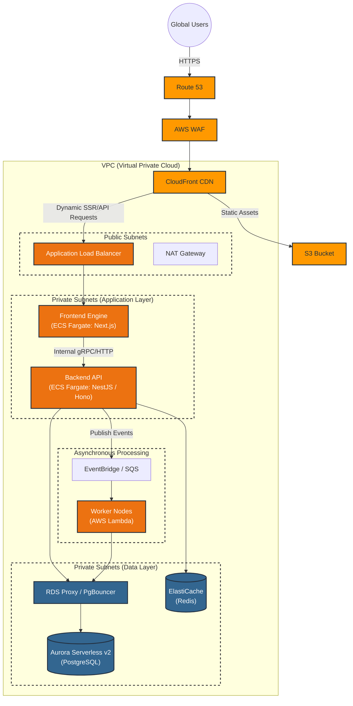
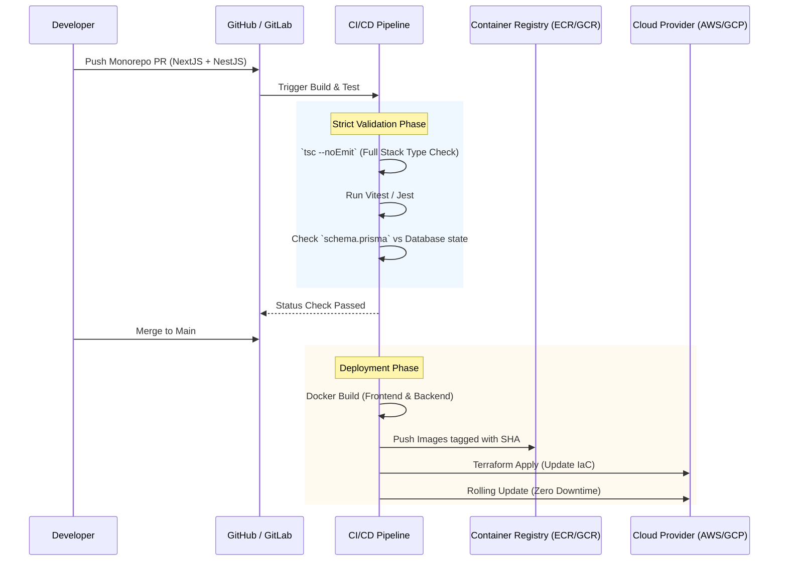

In our [last deep dive](/posts/005-unified-typescript-architecture/), we built the holy grail of developer experience: a unified, fully type-safe TypeScript full-stack architecture. We achieved zero manual API clients, instant compiler feedback, and shared schemas from the database up to the UI.

But a perfect, elegant monorepo is only half the battle. **Code is only as good as the infrastructure it runs on.**

I’ve analyzed and audited enough systems to know that "magic" frameworks often fall apart when they hit the harsh realities of network latency, connection pooling limits, and cold starts. We both strive for accuracy, and the truth is that blindly deploying a monolithic Next.js or NestJS app to a generic server without understanding the underlying plumbing is a recipe for outages and bloated cloud bills.

Today, we are taking our TypeScript architecture and mapping it directly to enterprise-grade cloud infrastructure. We will prioritize **AWS** as our foundational blueprint, but because we are skeptical of vendor lock-in, we will map this exact topology to Google Cloud, Azure, Tencent, and Alibaba.

## 🏗️ The AWS Blueprint: The "No-Compromise" Topology

When hosting a unified stack (Next.js/Remix + Hono/NestJS + PostgreSQL), we need a setup that handles server-side rendering (SSR), long-running backend processes, asynchronous worker queues, and highly available data storage.

We avoid clicking around in the console. Everything discussed below should be provisioned via **Infrastructure as Code (IaC)** using Terraform, OpenTofu, or AWS CDK.

### 1. The Edge & Presentation Layer (CloudFront + ECS)

Never let user traffic hit your compute instances directly.

- **AWS CloudFront** sits at the edge, caching static assets (images, compiled JS/CSS) directly from an **S3 bucket**.
- For dynamic Server-Side Rendering (SSR) pages (like Next.js `getServerSideProps` or React Server Components), CloudFront forwards the request to an **Application Load Balancer (ALB)**.
- The frontend runs as Docker containers on **ECS Fargate**. Why not Vercel or AWS Amplify? Because keeping your frontend in the same VPC as your backend eliminates public internet hops, massively reducing latency for your tRPC or GraphQL calls.

### 2. The Backend Compute (ECS Fargate vs. Lambda)

For the backend engine (NestJS, Express, or Encore.ts):

- **ECS Fargate (Containerized):** This is the safest, most accurate choice for complex backend frameworks. It avoids the dreaded "cold start" problem of serverless functions. Your containers stay warm, maintaining steady WebSocket connections and holding connection pools to the database.
- **AWS Lambda (Event-Driven Workers):** We still use Lambda, but *not* for the primary HTTP API. Instead, we use it for background processing. When the backend needs to send an email or process a video, it fires an event to **SQS** or **EventBridge**, which triggers a Lambda function to do the heavy lifting asynchronously.

### 3. The Database & Connection Proxy (Crucial Step)

If you are using Prisma or Drizzle ORM, you will instantly crash a traditional PostgreSQL database under heavy load because serverless frameworks open too many concurrent connections.

- **Amazon Aurora Serverless v2 (PostgreSQL):** It scales CPU and RAM vertically in milliseconds based on load.
- **RDS Proxy:** *Do not skip this.* You must place RDS Proxy (or a self-hosted PgBouncer container) in front of Aurora. It pools database connections, ensuring that even if your frontend scales to 1,000 containers, the database only sees a manageable number of persistent connections.

### 4. Networking (The Hidden Cost Trap)

As an expert reviewing architectures, the number one mistake I see is networking costs. If your private ECS containers need to talk to the public internet (e.g., calling a third-party API like Stripe), traffic routes through an **AWS NAT Gateway**. NAT Gateways charge per gigabyte of data processed. To mitigate this, rely heavily on **VPC Endpoints** so internal AWS services (like S3 or Secrets Manager) don't traverse the NAT.

## 🌐 The Cloud Equivalence Matrix

AWS is the industry default, but enterprise reality is often multi-cloud. Whether driven by regional compliance, vendor negotiations, or specific technical needs, you must be able to translate this architecture across providers.

Here is the exact equivalence mapping to ensure your TypeScript stack runs identically anywhere:

| **Architectural Component**       | **AWS**                         | **Google Cloud (GCP)**    | **Microsoft Azure**         | **Alibaba Cloud**           | **Tencent Cloud**           |
| --------------------------------- | ------------------------------- | ------------------------- | --------------------------- | --------------------------- | --------------------------- |
| **Global Edge & CDN**             | CloudFront + Route 53           | Cloud CDN + Cloud DNS     | Front Door + Azure DNS      | Alibaba CDN + DNS           | Tencent CDN + DNSPod        |
| **DDoS & Security**               | AWS WAF                         | Cloud Armor               | Azure WAF                   | Anti-DDoS Pro / WAF         | Tencent WAF                 |
| **Container Compute (SSR & API)** | ECS Fargate                     | Cloud Run *(Superior DX)* | Azure Container Apps        | Serverless App Engine (SAE) | Elastic Microservice (TSF)  |
| **Asynchronous Workers**          | AWS Lambda                      | Cloud Functions           | Azure Functions             | Function Compute (FC)       | Serverless Cloud Func (SCF) |
| **Relational Database**           | Aurora Serverless v2 (Postgres) | Cloud SQL for Postgres    | Azure DB for PostgreSQL     | ApsaraDB RDS for Postgres   | TencentDB for PostgreSQL    |
| **Connection Pooling**            | RDS Proxy                       | PgBouncer (Sidecar)       | PgBouncer (Built-in option) | Database Proxy              | Database Proxy              |
| **State & Query Cache**           | ElastiCache (Redis)             | Memorystore (Redis)       | Azure Cache for Redis       | ApsaraDB for Redis          | TencentDB for Redis         |
| **Message/Event Broker**          | SQS / EventBridge               | Pub/Sub                   | Service Bus / Event Grid    | Message Queue (RocketMQ)    | TDMQ (Pulsar/RabbitMQ)      |
| **Infrastructure as Code**        | AWS CDK / Terraform             | Terraform                 | Bicep / Terraform           | Terraform / ROS             | Terraform                   |

### Vendor-Specific Nuances to Double-Check

It is important to acknowledge that these services are not *perfect* 1:1 copies. If you are migrating your TypeScript monorepo to one of these alternatives, pay attention to these specifics:

- **Google Cloud Run vs. AWS Fargate:** GCP's Cloud Run is arguably the best container hosting platform on the market for developer experience. It scales to zero (unlike Fargate) and boots almost instantly. If you choose GCP, you can often merge the "Frontend Engine" and "Backend Engine" into a single Cloud Run service without cost penalties.
- **Azure Container Apps (ACA):** Built on top of Kubernetes (KEDA), ACA is incredibly powerful but introduces more networking complexity than AWS or GCP. Double-check your VNet configurations and Ingress rules, as default settings can sometimes expose internal gRPC/tRPC ports to the public internet.
- **Alibaba & Tencent (The APAC Giants):** When deploying in mainland China or Southeast Asia, these providers offer unbeatable latency. However, their serverless ecosystems heavily favor their proprietary API Gateways. When deploying NestJS or Hono here, it is often safer to stick to raw Container instances (SAE / TSF) rather than relying on their Function-as-a-Service bindings, which can lag behind modern Node.js versions.

## 🔒 Securing the Perimeter: CI/CD & Deployments

Infrastructure means nothing if your deployment pipeline is brittle. A unified TypeScript stack demands a unified pipeline.

To prevent regressions, your CI pipeline must act as an iron gate. Because the codebase uses a monorepo (via Nx or Turborepo), your GitHub Actions or GitLab CI should:

1. **Cache aggressively:** Only rebuild and test the Docker containers that actually changed.
2. **Run Database Migrations First:** Apply schema changes (e.g., `prisma migrate deploy`) backward-compatibly *before* routing traffic to the new containers.
3. **Blue/Green Deployments:** Utilize your Load Balancer to shift 10% of traffic to the new containers, monitor for HTTP 500 errors (which might indicate a mismatched tRPC schema that slipped through), and automatically roll back if the error rate spikes.

## 💡 The Bottom Line

A beautiful, type-safe codebase will not save you from poor cloud architecture.

By strategically placing your Next.js frontend and Hono/NestJS backend in the same private network, leveraging containerized orchestration instead of cold-start-prone functions for core routing, and strictly managing database connections via proxies, you bridge the gap between developer experience and production reliability.

You no longer have to choose between writing code quickly and running it safely. With the right IaC blueprint, you get both.
